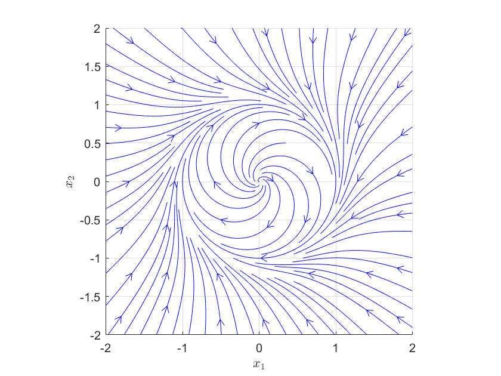

% Equations Différentielles I

<!-- LaTeX Macros -->
\newcommand{\N}{\mathbb{N}}
\newcommand{\Z}{\mathbb{Z}}
\newcommand{\Q}{\mathbb{Q}}
\newcommand{\R}{\mathbb{R}}
\newcommand{\Rgeq}{\R_{\geq 0}}
\newcommand{\Rg}{\R_{> 0}}
<!--\newcommand{\C}{\mathbb{C}}-->

\newcommand{\cS}{\mathcal{S}}
\newcommand{\cC}{\mathcal{C}}

\newcommand{\inter}{\mathop{\rm int}\nolimits}

\newcommand{\tmin}{t_m^-}
\newcommand{\tmax}{t_m^+}

Un peu d'histoire
=====================

L'étude des équations différentielles remonte au  XVII$^e$ siècle lors de la découverte du calcul infinitésimal et de la modélisation du mouvement par Kepler et Newton. Avec Leibniz, leur premier réflexe est alors de chercher à résoudre ces équations de manière exacte, par exemple par des primitives de fonctions connues ou bien sous forme de série, mais ces méthodes atteignent vite leurs limites, sauf dans des cas très particuliers. 

Alors que l'idée d'approximer les solutions apparaît au milieu du XVIII$^e$ siècle avec Euler, on cherche ensuite plutôt à caractériser leurs propriétés sans les connaître explicitement. Cauchy, et parallèlement Lipschitz, démontrent les premiers, au milieu du XIX$^e$ siècle, l'existence et l'unicité des solutions sous des hypothèses de régularités de l'équation différentielle.
Laplace, qui s'intéresse alors à la mécanique céleste, s'émerveille devant la capacité de l'Homme à prédire l'évolution du monde physique. C'est l'avénement du *déterminisme* c'est-à-dire la certitude que l'état du monde futur (ou passé) peut être prédit de manière unique par la connaissance de l'état initial. 

Cependant, à la fin du  XIX$^e$ siècle, les travaux de Poincaré et de ses contemporains mettent en évidence les limites de ce déterminisme. Le constat que le modèle physique n'est jamais exactement connu, ni sa condition initiale, amène les scientifiques à étudier la sensibilité des solutions à ces erreurs.  Une sensibilité extrême chez certains systèmes rend leur simulation impossible sur des temps longs et mène à la théorie du *chaos* qui occupera les scientifiques durant une grande partie du XX$^e$ siècle. 

En parallèle, l'étude de la stabilité et du comportement asymptotique des solutions intéresse dès le XIX$^e$ siècle, d'abord dans le cas des systèmes linéaires avec des mathématiciens comme Ruth, Hurwitz, etc. Mais c'est finalement la thèse de Lyapunov à la fin du  XIX$^e$ siècle qui lance la théorie générale de la stabilité des systèmes non linéaires qui sera ensuite étayée tout au long des XX$^e$ et XXI$^e$ siècles.

Objectifs du cours
========================

Ce cours est une introduction à l'étude non linéaire des équations différentielles. Pour une étude plus complète voir par exemple [@Hale]. En première lecture, les objectifs "opérationnels" sont les suivants :

 - savoir réduire une équation différentielle à l'ordre 1.

 - savoir justifier l'existence de solutions par le théorème de Peano lorsque "$f$ est continue".

 - comprendre la notion de solution maximale et savoir qu'elles sont définies tant qu'elles "n'explosent" pas et tant qu'elles n'atteignent pas la frontière du domaine où l'équation différentielle est définie. Savoir justifier qu'une solution est définie sur tout l'intervalle de temps $\R$ si ces éventualités ne peuvent se réaliser en temps fini et/ou en faisant appel au critère "linéairement borné".

 - savoir justifier l'unicité des solutions maximales par le théorème de Cauchy-Lipschitz lorsque "$f$ est continûment différentiable par rapport à $x$".

 - comprendre (qualitativement) dans quelle mesure une erreur sur la condition initiale se répercute sur les solutions en temps fini. 

 - savoir trouver les points d'équilibre.

 - savoir déterminer si un système linéaire est globalement asymptotiquement stable en regardant le signe de la partie réelle de ses valeurs propres.

 - savoir déterminer si un point d'équilibre est localement asymptotiquement stable/instable par les valeurs propres de la matrice Jacobienne associée.

 - savoir montrer la stabilité d'un point d'équilibre par la décroissance d'une fonction définie positive.

 - savoir montrer la bornitude des solutions en temps positif lorsque cette fonction décroissante est propre.

 - savoir étudier la convergence des solutions vers un point d'équilibre par l'application répétée du lemme de Barbalat.

En deuxième lecture :

 - comprendre la preuve du théorème de Cauchy-Lipschitz en voyant la solution comme un point fixe de la représentation intégrale des solutions.

 - savoir que l'on peut relâcher l'hypothèse du théorème de Cauchy-Lipschitz à "$f$ Lipschitzienne par rapport à $x$". 

 - comprendre ce qu'est un système chaotique et ce que représente son exposant de Lyapunov.

 - comprendre ce que la notion de stabilité apporte en plus de l'attractivité dans la notion de stabilité asymptotique.

 - connaître, comprendre et savoir appliquer les critères de stabilité de Lyapunov. 

**Notations** 

<!--
- $C(U, V)$ : ensemble des fonctions continues $f:U\to V$

- $C^p(U, V)$ : ensemble des fonctions $f:U\to V$ continûment différentiables d'ordre $p\geq 1$.
-->

- $B(x,r)$ : boule ouverte centrée en $x$ et de rayon $r$.

- $B_f(x,r)$ : boule fermée centrée en $x$ et de rayon $r$.

- Pour $x:I\subset\R\to \R^n$, $\dot{x}(t)=\frac{dx}{dt}(t)$ et $\ddot{x}(t)=\frac{d^2x}{dt^2}(t)$.

Cadre de l'étude
============================

Les équations différentielles apparaissent couramment en physique pour décrire l'évolution des grandeurs décrivant le système.

### Equations différentielles en physique {.exemple #ex_equaDiffPhys}

- La tension $u_c$ aux bornes d'un condensateur dans un circuit RLC en série évolue selon 
$$
\ddot{u}_c = -\frac{R}{L} \dot{u}_c - \frac{1}{LC} u_c + u(t)
$$
où $R$, $L$, $C$ notent la résistance, inductance et capacité respectivement, et $u$ la tension appliquée par le générateur. Cette équation différentielle implique les dérivées de $u_c$ jusqu'à l'ordre 2, donc on parle d'équation différentielle d'ordre 2.

<!--- Un moteur électrique à aimant permanent évolue selon
\begin{align*}
L \dot{\overline{i_\alpha}} &= -Ri_\alpha + \omega \phi \sin\theta +u_\alpha(t) \\
L \dot{\overline{i_\beta}} &= -Ri_\beta - \omega \phi \cos\theta +u_\beta(t) \\
J\dot{\omega} &= p\phi(-i_\alpha\sin\theta + i_\beta \cos\theta) - a \, \omega -\tau(t) \\
\dot{\theta} &= \omega
\end{align*}
où $(u_\alpha,u_\beta)$ est la tension appliquée au stator, $(i_\alpha,i_\beta)$ l'intensité du courant dans le stator, $R$ et $L$ sa résistance et son inductance respectivement, $\phi$ l'intensité du champ électromagnétique créé par l'aimant, $\theta$ l'angle du moteur, $\omega$ sa vitesse, $a$ un paramètre de frottement et $\tau$ la charge. Ici, seules dérivées d'ordre 1 apparaissent donc c'est une équation différentielle d'ordre 1.
-->

- En cinétique chimique, les concentrations des espèces chimiques intervenant dans une réaction
$$
A+ B \overset{k}{\underset{k'}{\leftrightarrows}}  C 
$$
sont régies par une équation différentielle d'ordre 1 donnée par
\begin{align*}
\dot{c}_A &= -k \, c_Ac_B + k'c_C \\
\dot{c}_B &= -k \, c_Ac_B + k'c_C\\
\dot{c}_C &= k \, c_Ac_B - k'c_C
\end{align*}
avec $k,k'$ les constantes de réaction. Cette équation différentielle n'a pas de terme extérieur variant avec le temps. On dit qu'elle est *autonome*.

- La mécanique Newtonienne ou Lagrangienne amène typiquement à des équations du type
$$
M \ddot{q} = \sum_k F_k(t,q,\dot{q})
$$
où $q\in \R^n$ modélise la position du système (spatiale, angulaire, etc), $\dot{q}$ sa vitesse et $\ddot{q}$ son accélération, avec $M$ la matrice d'inertie, et $F_k$ les forces/couples agissant sur le système. Ici il s'agit d'une équation différentielle d'ordre 2.

Dans tous ces cas, on s'intéresse aux signaux du temps $t\mapsto y(t)$ de classe $C^p$ qui vérifient une équation du type 
$$
y^{(p)}(t) = \psi\left(t,y(t),\dot{y}(t),\ldots, y^{(p-1)}(t)\right)
$$
sur son ensemble de définition, où $p\in \N^*$ désigne l'ordre de l'équation différentielle.
En fait, on se rend compte que $y$ de classe $C^p$ vérifie l'équation différentielle ci-dessus si et seulement si $x=(y,\dot{y},\ldots,y^{(p-1)})$ de classe $C^1$ vérifie
$$
\dot{x} = f(t,x) \ , 
$$
où $f$ est définie par
$$
f(t,y_0,y_1,\ldots,y_{p-1}) = (y_1,y_2,\ldots,y_{p-1},\psi(t,y_0,\ldots,y_{p-1})) \ .
$$

Nous déduisons que résoudre une équation différentielle d'ordre $p$ est en fait équivalent à résoudre une équation différentielle d'ordre 1, quitte à considérer comme inconnue la suite des dérivées $x=(y,\dot{y},\ldots,y^{(p-1)})$ de classe $C^1$, au lieu de $y$ de classe $C^p$. $x$ est appelé l'*état* du système.  

<!--
### Réduction à l'ordre 1

Soient $p\in\N^*$, $J$ ouvert de $\R$, $Y$ ouvert de $\R^{np}$ et $\psi:J\times Y  \to \R^n$ une application continue. 
Alors $y$ est solution de l'équation différentielle d'ordre $p$ 
$$
y^{(p)} = \psi(t,y,\dot{y},\ldots, y^{(p-1)})
$$
si et seulement si $x=(y,\dot{y},\ldots,y^{(p-1)})$ est solution de l'équation différentielle d'ordre 1
$$
\dot{x} = f(t,x) \ , 
$$
où $f:J\times Y \to \R^{np}$ continue est définie par
$$
f(t,y_0,y_1,\ldots,y_{p-1}) = (y_1,y_2,\ldots,y_{p-1},\psi(t,y_0,\ldots,y_{p-1})) \ .
$$

Nous déduisons que résoudre une équation différentielle d'ordre $p$ est en fait équivalent à résoudre une équation différentielle d'ordre 1, quitte à considérer comme inconnue la suite des dérivées $x=(y,\dot{y},\ldots,y^{(p-1)})\in C^1(I,\R^{np})$, au lieu de $y\in C^p(I,\R^n)$.  Dans la suite de ce cours, nous nous restreignons donc à $p=1$. $x$ est appelé l'*état* du système.
-->

### Réduction à l'ordre 1 {.example #ex_reducOrdre1} 

Reprenons les exemples plus haut :

- pour un circuit RLC, on prend $x=(u_c,\dot{u}_c)\in \R^2$, et 
$$
f(t,x_1,x_2) = 
\left[
    \begin{matrix}
        x_2\\
        -\frac{R}{L} x_2 - \frac{1}{LC} x_1 + u(t)
    \end{matrix}
\right] \ .
$$

<!-- - pour le moteur électrique, $x=(i_\alpha,i_\beta,\theta,\omega)\in \R^4$ et
$$
f(t,x_1,x_2,x_3,x_4) = \left[
    \begin{matrix}
        \frac{1}{L}(-Rx_1 + x_4 \phi \sin x_3 +u_\alpha(t))\\
        \frac{1}{L}(-R x_2 - x_4 \phi \cos x_3 +u_\beta(t)  ) \\
        x_4 \\
        \frac{1}{J}(p\phi(-x_1\sin x_3 + x_2 \cos x_3) - a \, x_4 -\tau(t))
    \end{matrix}
\right]
$$
-->

- en cinétique chimique, $x=(c_A,c_B,c_C)\in \R^3$ et 
$$
f(t,x_1,x_2,x_3) = \left[
    \begin{matrix}
         -k \, x_1x_2 + k'x_3 \\
         -k \, x_1x_2 + k'x_3\\
         k \, x_1x_2 - k'x_3
    \end{matrix}
\right]
$$

- en mécanique, $x=(q,\dot{q})$ et
$$
f(t,x_1,x_2) = 
\left[
    \begin{matrix}
        x_2\\
        M^{-1} \sum_k F_k(t,x_1,x_2)
    \end{matrix}
\right] \ .
$$

Ainsi, même si la physique nous donne initialement une équation différentielle d'ordre supérieur, on pourra toujours se ramener à l'ordre 1. Cette réduction est cruciale pour l'étudier mathématiquement ainsi que numériquement, et devra donc être systématique.

Commençons par définir le cadre de cette étude.

<!-- Dans la suite de ce cours, nous nous restreignons donc à $p=1$. -->

<!--
### Solution d'une équation différentielle  {.definition}

Soient $n\in \N^*$, $J$ ouvert de $\R$, $Y$ ouvert de $\R^{np}$ et $\psi:J\times Y \to \R^n$ une application continue. Une fonction $y:I\to \R^n$ sur un intervalle de temps $I\subset \R$ non réduit[^intI] à un point, est dite *solution[^solsurI]* de *l'équation différentielle d'ordre $p$* 
$$
y^{(p)} = \psi(t,y,\dot{y},\ldots, y^{(p-1)})
$$
si $y$ est de classe $C^p$ sur $I$ et pour tout $t\in \mathring{\overline{I}}$,

- $(t,y(t),\dot{y}(t),\ldots, y^{(p-1)}(t)) \in J\times Y$

- $y^{(p)}(t) = \psi(t,y(t),\dot{y}(t),\ldots, y^{(p-1)}(t))$.
-->

### Solution d'une équation différentielle  {.definition}

Soient $n\in \N^*$, $J$ ouvert de $\R$, $X$ ouvert de $\R^{n}$ et $f:J\times X \to \R^n$ une application continue. Une fonction $x:I\to \R^n$ définie sur un intervalle de temps $I\subset J$ non réduit[^intI] à un point, est dite solution[^solsurI] de l'équation différentielle
$$
\dot{x} = f(t,x)
$$
si $x$ est continue sur $I$ avec $x(t)\in X$ pour tout $t\in I$, et de classe $C^1$ sur $\mathring{I}$ avec $\dot{x}(t) = f(t,x(t))$ pour tout $t\in \mathring{I}$.

L'équation différentielle est dite *autonome* si l'application $f$ ne dépend pas de $t$. Dans ce cas, on peut aussi définir directement $f: X \to \R^n$. 

Lorsque l'intervalle de temps $I$ de définition de la solution est $J$ entier, on dira que la solution est *globale*. Mais on verra qu'il peut parfois arriver qu'une solution ne puisse être définie sur $J$ entier, par exemple si elle explose avant, ou si elle s'apprête à quitter $X$.

Notons que $f$ sera souvent définie sur $J\times X=\R\times \R^{n}$. Cependant, il peut arriver que cela ne soit pas le cas, comme par exemple pour deux corps de position $y_a,y_b$ dont la force d'interaction gravitationnelle $\frac{Gm_a m_b}{\|y_a-y_b\|^2}$ n'est définie que pour $y_a\neq y_b$, où lorsque l'on veut restreindre l'étude des solutions à un domaine particulier.

### 

La physique s'intéresse souvent aux solutions partant d'une *condition initiale* donnée. La recherche et l'étude de ces solutions particulières est due à Cauchy et porte le nom de *Problème de Cauchy* :

> Dans mes leçons données à l'École Polytechnique, comme dans la plupart des ouvrages ou mémoires que j'ai publiés sur le calcul intégral, j'ai cru devoir placer en premier lieu la recherche, non pas des intégrales générales, mais des particulières ; en sorte que la détermination des constantes ou des fonctions arbitraires ne fût plus séparée de la recherche des intégrales.

### Problème de Cauchy (*Initial Value Problem*) {.definition #def_cauchy}
Soient $J$ ouvert de $\R$, $X$ ouvert de $\R^{n}$, $(t_0,x_0)\in J\times X$ et $f: J\times X \to \R^n$ continue. Le *problème de Cauchy* associé fait référence au système
$$
\dot{x}=f(t,x) \quad , \quad x(t_0)=x_0 \ .
$$
On dira donc que $x:I\to \R^n$ est solution du problème de Cauchy défini par $f$ et $(t_0,x_0)$ si

- $t_0\in I$ et $x(t_0)=x_0$

- $x$ est solution de l'équation différentielle $\dot{x}=f(t,x)$ sur $I$.
<!-- pour tout $t\in I$, $(t,x(t)) \in U$ et $\dot{x}(t)=f(t,x(t))$ -->

On notera alors $x\in S_f(t_0,x_0)$.

Avant d'étudier les solutions d'un problème de Cauchy, il est crucial de remarquer la caractérisation qui suit.

### Représentation intégrale des solutions {.theorem #theo_eq_integrale}

Soient $J$ ouvert de $\R$, $X$ ouvert de $\R^{n}$, $f: J\times X \to \R^n$ continue, $I\subset J$ un intervalle de $\R$ non réduit à un point, $t_0\in I$, $x_0\in X$, et $x: I\to \R^n$ continue telle que $x(t)\in X$ pour tout $t\in I$. Alors, $x$ est solution du problème de Cauchy défini par $f$ et $(t_0,x_0)$ si et seulement si $x$ est solution de l'équation intégrale
$$
x(t) = x_0 + \int_{t_0}^t f(s,x(s))ds \qquad \forall t\in I \ .
$$

Notons que cette caractérisation n'aurait pas été possible si l'on avait gardé une équation différentielle d'ordre $p>1$.

### Démonstration {.proof} 
Supposons $x\in S_f(t_0,x_0)$. Alors $x: I\to \R^n$ est de classe $C^1$ sur $\mathring{I}$, et pour tout $t\in I$,
$$
x_0 + \int_{t_0}^t f(s,x(s))ds = x(t_0)  + \int_{t_0}^t \dot{x}(s) ds = x(t) \ .
$$
Réciproquement, si $x$ vérifie l'équation intégrale sur $I\subset J$, $x(t_0)=x_0$, et puisque $f$ est continue sur $I\times X$ et $x$ continue sur $I$, $x$ est de classe $C^1$ sur $I$ et par dérivation, $\dot{x}(t)=f(t,x(t))$ pour tout $t\in I$.

### Classe plus générale de solutions {.remark}

La définition sous forme intégrale des solutions montre que la recherche de solutions $C^1$ et l'hypothèse de continuité de $f$ pourraient être relachées : il suffirait de chercher $x$ absolument continue et pouvoir définir l'objet $\int_{t_0}^t f(s,x(s))ds$. Mais il est tout de même souhaitable d'assurer un minimum de propriétés telles que l'existence de solutions, comme nous allons le voir dans la section suivante.

### Portrait de phase   

En dimension 2 (ou 3), il est possible de visualiser géométriquement le comportement des solutions en traçant les courbes paramétriques $t\mapsto(x_1(t),x_2(t))$ dans le plan (ou $t\mapsto(x_1(t),x_2(t),x_3(t))$ dans l'espace) pour différentes conditions initiales. C'est ce que l'on appelle un *portrait de phase*. Voir [Figure](#fig_pendule) ci-dessous dans le cas d'un pendule.

{#fig_pendule}

Etude du problème de Cauchy
================================

Existence de solutions locales
--------------------------------

Notre point de départ est le théorème suivant établi à la fin du XIX$^e$ siècle, qui assure l'existence locale de solutions au [problème de Cauchy](#def_cauchy) sous une simple hypothèse de continuité de $f$. En d'autres termes, dans le cadre de ce cours où $f$ est supposée continue, il existe toujours des solutions pour toute condition initiale, définies au moins pour un certain temps.

### Théorème de Peano-Arzelà {.theorem  #theo_peano}
Soient $J$ ouvert de $\R$, $X$ ouvert de $\R^{n}$, $f: J\times X \to \R^n$ continue. Pour tout $(t_0,x_0)\in J\times X$, il existe $\tau_m >0$ et $x :[t_0-\tau_m,t_0+\tau_m]\to\R^n$ tels que $x$ est solution du problème de Cauchy défini par $f$ et $(t_0,x_0)$.

### Démonstration {.proof}
La démonstration de ce résultat est hors-programme et fait appel au théorème d'Ascoli(-Arzelà). Seule la connaissance et la compréhension du résultat est exigible. Pour les curieux, la preuve est donnée en [annexe](#app_peano). 

### Classe plus générale de solutions (pour la culture) {.remark}
L'existence de solutions $C^1$ est garantie lorsque $f$ est continue. Il s'avère que l'existence de solutions *absolument continues*, est garantie sous les hypothèses plus faibles suivantes dans un voisinage de $(t_0,x_0)$ :

- pour tout $t$, $x\mapsto f(t,x)$ est continue ;

- pour tout $x$, $t\mapsto f(t,x)$ est mesurable ; 

- il existe une fonction intégrable $t\mapsto b(t)$ telle que $|f(t,x)|\leq b(t)$ pour tout $(t,x)$.

 Ce sont les conditions de *Carathéodory*. Voir [@Hale]. Un cadre encore plus général consiste à autoriser des discontinuités de $f$ par rapport à $x$ mais l'étude des solutions passe alors par celle des *inclusions différentielles* du type $\dot{x} \in F(t,x)$, ce qui nous amènerait bien trop loin de ce cours.  Voir [@Fil].

 
Domaine d'existence des solutions
--------------------------------

Nous venons de voir que des solutions locales au problème de Cauchy existent si $f$ est continue. Nous savons qu'elles sont définies *au moins un certain temps*, mais il est intéressant de se demander quel est l'intervalle de temps *maximal* sur lequel elles peuvent être définies. En d'autres termes, on s'intéresse aux *solutions maximales*.

### Solution maximale {.definition #def_sol_max}
Soient $J$ ouvert de $\R$, $X$ ouvert de $\R^{n}$, $f: J\times X \to \R^n$ continue. On dit que $x : I \to\R^n$ est une solution *maximale* de l'équation différentielle 
$$
\dot{x}=f(t,x)
$$
si elle n'est pas *prolongeable* en une solution définie plus longtemps dans $J\times X$. En d'autres termes, il n'existe pas de solution $x' : I'\to\R^n$ avec $I$ strictement inclus dans $I'$ et telle que $x=x'$ sur $I$. On dit alors que $I$ est l'*intervalle maximal d'existence* de la solution.

<!--
Dans la section précédente, nous avons vu que lorsque $f$ est $C^1$ par rapport à $x$, la solution maximale au problème de Cauchy (qui est alors unique) est définie sur un intervalle ouvert. 
-->
Il s'avère que l'intervalle maximal de définition $I$ d'une solution maximale n'est pas nécessairement $\R$ entier même si $f$ est définie globalement sur $\R \times \R^n$ et $f$ est de classe $C^\infty$.  

### Explosion en temps fini {.example #ex_explTempsFini}

Considérons le problème de Cauchy
$$
\dot{x} = x^2 \quad , \qquad (t_0,x_0)\in \R^2 \ .
$$
L'application $f:(t,x)\mapsto x^2$ est continue sur $\R^2$, donc il existe au moins une solution. On peut par exemple vérifier que $x:I\to \R$ définie par
$$
x(t)=\frac{x_0}{1-x_0(t-t_0)} \quad , \quad I=\left]-\infty,t_0+\frac{1}{x_0}\right[ 
$$
est bien solution. Vu qu'elle diverge au temps $t_0+\frac{1}{x_0}$, elle ne peut être prolongée au delà. Elle est donc maximale et on dit qu'elle *explose en temps fini*. 

{#fig_explo_temps_fini}

En fait, le théorème suivant montre que les solutions maximales sont définies sur un intervalle ouvert,  et cet intervalle n'est borné que si $t\mapsto x(t)$ diverge en temps fini ou $t\mapsto(t,x(t))$ tend vers la frontière de l'ensemble de définition $J\times X$ de $f$ en temps fini. 
<!--la paire $(t,x(t))$  quitte nécessairement n'importe quel compact de $J\times X$ au bout d'un certain temps. Dans le cas usuel où $J\times X=\R\times \R^n$, ceci implique donc que toute solution maximale non globale, i.e. définie sur $\left[0,\tmax\right[$ avec $\tmax<+\infty$, explose en temps fini, c'est-à-dire
$$
\lim_{t\to \tmax} \|x(t)\|=+\infty \ ,
$$
Dans le cas où $J\times X$ ne serait pas l'espace entier, une solution non globale pourrait aussi tendre en temps fini vers le "bord" de $J\times X$ sans nécessairement diverger. C'est ce qui est formalisé dans le théorème suivant.-->
<!--
### Théorème des bouts {.theorem #theo_bouts}
Soient $J$ ouvert de $\R$, $X$ ouvert de $\R^{n}$, $f: J\times X \to \R^n$ continue de classe $C^1$ par rapport à $x$. Soient $(t_0,x_0)\in J\times X$ et $x:\left]\tmin,\tmax\right[\to \R^n$ la solution maximale au problème de Cauchy correspondant.  Alors pour tout compact $K\subset J\times X$, il existe $t_K^+ \in \left[t_0,\tmax\right[$ and $t_K^-\in \left]\tmin,t_0 \right]$) tels que
$$
(t,x(t))\notin K \qquad \forall t\in \left]\tmin,t_K^- \right] \cup \left[t_K^+,\tmax \right[ 
$$

### Démonstration {.proof} 
Voir en [annexe](#pr_theo_bouts). 
-->

### Domaine maximal d'existence {.theorem #theo_bouts}
Soient $J$ ouvert de $\R$, $X$ ouvert de $\R^{n}$, $f: J\times X \to \R^n$ continue et $(t_0,x_0)\in J\times X$. Toute solution du problème de Cauchy défini par $f$ et $(t_0,x_0)$ est prolongeable en une solution maximale et toute solution maximale $x:I\to \R^n$  est définie sur un intervalle ouvert $\left]\tmin,\tmax\right[$ avec $\tmin,\tmax\in \R\cup\{+\infty,-\infty\}$. De plus, si $\tmax$ (resp. $\tmin$) est fini alors

 - ou bien $(t,x(t))$ tend vers la frontière de $J\times X$ lorsque $t$ tend vers $\tmax$ (resp. $\tmin$),

 - ou bien $x$ diverge lorsque $t$ tend vers $\tmax$ (resp. $\tmin$),

c'est-à-dire, si $\tmax$ est fini alors
$$
\lim_{t\to \tmax} d\Big((t,x(t)),\partial (J\times X) \Big) = 0  \quad  \text{ou} \quad 
\lim_{t\to \tmax} \|x(t)\| = +\infty 
$$
et si $\tmin$ est fini alors
$$
\lim_{t\to \tmin} d\Big((t,x(t)),\partial (J\times X) \Big) = 0  \quad  \text{ou} \quad 
\lim_{t\to \tmin} \|x(t)\| = +\infty  \ .
$$

### Démonstration {.proof} 
La preuve complète est donnée en [annexe](#pr_theo_bouts). On commence par observer que si l'intervalle d'existence n'était pas ouvert, la solution pourrait être prolongée au bord grâce au théorème de Peano, ce qui contredirait sa maximalité. Ensuite, la preuve consiste à montrer que si $\tmax$ (resp. $\tmin$) est fini, alors $(t,x(t))$ finit forcément par sortir définitivement de tout compact de $J\times X$ lorsque $t$ tend vers $\tmax$ (resp. $\tmin$), et donc soit diverger soit tendre vers la frontière de l'ouvert $J\times X$. 

###

En pratique, pour montrer que les solutions maximales sont définies pour tout temps, i.e., sur $\R$, il suffit donc de montrer qu'elle ne peuvent pas exploser en temps fini (par exemple si elle sont bornées sur tout intervalle de temps fini), et qu'elle ne peuvent pas tendre vers le bord de $J\times X$ en temps fini (par exemple si $J\times X= \R \times \R^n$). Un cas particulier où les solutions maximales sont forcément définies sur $J$ entier est donné ci-dessous.

### Critère d'existence globale {.theorem #theo_exist_glob}
Soient $J$ un intervalle ouvert de $\R$ et $f:J\times\R^n\to\R^n$ continue. Si $f$ a une *croissance au plus affine*, c'est-à-dire, s'il existe $a,b: J\to\R$ continues telles que  
$$
\|f(t,x)\|\leq a(t) \|x\| + b(t) \quad \forall (t,x)\in J\times \R^n \ ,
$$
alors toute solution maximale est définie sur $J$ entier. 

### Démonstration {.proof} 
Prouvé dans l'exercice [*Autour du Lemme de Grönwall*](#exo_gronwall). 

### Solutions globales {.example #ex_solGlob}

- Considérons une équation différentielle *linéaire*, c'est-à-dire pour laquelle il existe $A:\R\to\R^{n\times n}$ et $b:\R\to\R^n$ continues telles que
$$
f(t,x) = A(t) x + b(t) \ .
$$
D'après le théorème précédent, quelle que soit la condition initiale $(t_0,x_0)\in I\times\R^n$, ses solutions maximales sont définies sur $I$ entier (on verra dans la suite qu'il en existe une unique pour chaque condition initiale). Dans le cas où $A$ est constant, on en a même une formule explicite (obtenue par la méthode de *variation de la constante*)
$$
x(t) = e^{A(t-t_0)}x_0 + \int_{t_0}^t e^{A(t-s)} b(s)ds \ ,
$$
où $e^{A(t-s)}$ est l'exponentielle de matrice définie par
$$
e^{A(t-s)}=\sum^{+\infty}_{p=0} \frac{A^p(t-s)^p}{p!} \ .
$$
Attention, cette formule  ne fonctionne que si $A$ est constant. Notons que si $A$ est diagonalisable, i.e., il existe $P\in \R^{n\times n}$ telle que $A = P^{-1} D  P$ avec $D\in \R^{n\times n}$ une matrice diagonale contenant les valeurs propres de $A$, alors
$$
e^{A(t-s)} = P^{-1} e^{D(t-s)}  P
$$
donc les solutions avec $b=0$ sont des combinaisons linéaires de $e^{\lambda_i t}$ où $\lambda_i$ sont les valeurs propres de $A$. Ceci n'est plus vrai lorsque $A$ n'est pas diagonalisable. Voir l'[étude de stabilité d'un système linéaire](#Hurwitz).

- Un autre cas important d'une croissance au plus affine est lorsque $f$ est globalement bornée en $x$. Par exemple, 
$$
f(t,x)=c(t)\arctan(x) \qquad \text{ ou } \qquad 
f(t,x)=\frac{c(t)}{1+x^2}
$$
engendrent des problèmes de Cauchy aux solutions globales.

<!--- Bien sûr, la fonction $f:(t,x)\mapsto x^2$ ne satisfait pas la croissance au plus affine et [on a vu](#ex_lips) que les solutions associées explosent en temps fini. Par contre, si l'on prend $f(t,x)=-x|x|$ ou $f(t,x)=-x^3$ qui ne satisfont pas non plus cette condition, on peut montrer que les solutions maximales sont globales (et tendent vers 0). On en déduit donc que la croissance au plus affine est  suffisante mais pas nécessaire pour garantir la globalité des solutions.-->

### Solutions globales I {.exercise .question #glob_sol .one}

Justifier que pour toute condition initiale,  
$$
\begin{array}{rcl}
\dot{x}_1 &=& \sin x_1 - \sqrt{|t|} x_2 \\
\dot{x}_2 &=& \sqrt{1+x_1^2}
\end{array}
$$
admet des solutions et les solutions maximales sont définies sur $\R$.

### Solutions globales II {.exercise .question #glob_sol2 .two}
Soient $f:\R \times \R^n \to \R^n$ continue et  $V:\R^n \to \R$ définie par $V(x) = x^\top x$ telles que
$$
\langle\nabla V (x), f(t,x)\rangle \leq a(t) V(x) + b(t)  \qquad \forall (t,x)\in \R\times \R^n
$$
avec $a,b:\R \to \R$ continues. Montrer que quelque soit la condition initiale $(t_0,x_0)\in \R\times \R^n$, les solutions maximales de 
$\dot{x} = f(t,x)$
sont définies sur $[t_0,+\infty[$. On pourra pour cela étudier l'évolution de $t\mapsto V(x(t))$.

### Solutions globales III {.exercise .question #glob_sol3 .two}
Soient $f:\R \times \R^n \to \R^n$ continue et  $V:\R^n \to \R$ telle que 
$$
\lim_{\|x\| \to +\infty} V(x) = +\infty \quad \text{et} \quad \langle\nabla V(x), f(t,x)\rangle \leq 0  \qquad \forall (t,x)\in \R\times \R^n \ .
$$
Montrer que quelque soit la condition initiale $(t_0,x_0)\in \R\times \R^n$, les solutions maximales de 
$\dot{x} = f(t,x)$
sont définies et bornées sur $[t_0,+\infty[$. On pourra pour cela étudier l'évolution de $t\mapsto V(x(t))$.

Unicité des solutions maximales
-------------------------------

Si des solutions maximales existent toujours, elles ne sont pas toujours uniques. 

### Non-unicité des solutions {.example #ex_nonUnique}

Considérons le problème de Cauchy
$$
\dot{x}=-\sqrt{|x|} \qquad , \qquad (t_0,x_0)=(0,0) \ .
$$ 
Ce système permet en particulier de modéliser l'écoulement d'un fluide dans un réservoir, selon la loi de *Torricelli* (voir [exercice](#exo_Torricelli)).
La fonction $f:(t,x)\mapsto -\sqrt{|x|}$ est continue sur $\R\times \R$, donc ce problème de Cauchy admet au moins une solution. Mais on montrera en [exercice](#exo_Torricelli) qu'il existe une infinité de solutions maximales. Plus de détails sont donnés dans le notebook Equations Différentielles I.ipynb.

Le théorème suivant, dit de *Cauchy-Lipschitz*, montre que l'unicité des solutions maximales est garantie si $f$ est de plus continûment différentiable par rapport à la variable $x$. On voit que ce n'est pas le cas de $x\mapsto -\sqrt{|x|}$ en 0. Le théorème et la preuve de l'époque sont disponibles en ligne dans des notes de cours [@cauchy].

### Théorème de Cauchy-Lipschitz (ou de Picard-Lindelöf) {.theorem #theo_lips}
Soient $J$ ouvert de $\R$, $X$ ouvert de $\R^{n}$, $f: J\times X \to \R^n$ continue et continûment différentiable par rapport à $x$, i.e. $(t,x)\mapsto \partial_x f(t,x)$ existe et est continue sur $J\times X$.
Alors pour tout $(t_0,x_0)\in J\times X$, il existe une unique solution maximale $x:I\subset J\to\R^n$ au problème de Cauchy défini par $f$ et $(t_0,x_0)$. 
<!-- De plus,  l'intervalle $I$ est ouvert et contient un voisinage de $t_0$.-->

### Démonstration {.proof} 

Nous donnons ici le principe de la preuve qui peut être passée en première lecture, mais qu'il est intéressant de comprendre d'un point de vue scientifique. L'essentiel est en fait de montrer que sous l'hypothèse de régularité de $f$ par rapport à $x$, il existe une unique solution locale au problème de Cauchy. De là on peut ensuite déduire qu'elle se prolonge en une unique solution maximale dans $J\times X$. 
<!--L'ouverture de son intervalle de définition vient du fait qu'elle serait sinon de nouveau prolongeable *au bord* de l'intervalle puisque $J\times X$ est ouvert, ce qui contredirait sa maximalité. -->
La partie cruciale est donc le résultat local suivant qui constitue en fait le théorème initial de Cauchy-Lipschitz (sa généralisation aux solutions globales étant plutôt dûe à [Picard et Lindelöf](#rem_approx_succ)).

**Théorème de Cauchy-Lipschitz local** Soient $J$ ouvert de $\R$, $X$ ouvert de $\R^{n}$, $f: J\times X \to \R^n$ continue et continûment différentiable par rapport à $x$, et $(t_0,x_0)\in J\times X$. Soient $\tau>0$ et $r>0$ tels que 
$$
\cC:=\left[t_0-\tau,t_0+\tau \right]\times B_f(x_0,r)\subset J\times X \ .
$$
Pour tout $\tau_m\in \left[0,\tau \right]$ tel que $\tau_m  \max_{\cC} \|f\| \leq r$,
<!--- $$
f_m := \max_{\cC} f \quad , \quad \tau_m := \min\left\{\tau,\frac{r}{f_m} \right\}
$$--->
toute solution $x$ au problème de Cauchy défini par $f$ et $(t_0,x_0)$ est définie de manière unique sur $[t_0-\tau_m,t_0+\tau_m]$. 

**Démonstration**

La preuve consiste à voir les solutions comme des points fixes d'un certain opérateur intégral, obtenu par la représentation intégrale des solutions. Le théorème du point fixe de Banach permet ensuite de montrer l'existence et l'unicité de ce point fixe.

Tout d'abord, $\cC$ étant compact, par continuité de $f$, $\max_\cC \|f\|$ existe bien.  Par ailleurs, l'ensemble des fonctions continues de $[t_0-\tau_m,t_0+\tau_m]$ dans $\R^n$, que nous notons $E$, est complet[^Ecomplet] pour la norme uniforme $\|\cdot\|_\infty$, et définissons  
$$
F = \{x\in E \: : \: x(\left[t_0-\tau_m,t_0+\tau_m \right])\subset B_f(x_0,r) \} \ .
$$
On peut montrer que[^Fferme] $F$ est un sous-ensemble fermé de $E$. $F$ est donc complet  (toujours pour la norme uniforme $\|\cdot\|_\infty$). 
Pour tout $x\in F$, par définition, $(s,x(s))\in \cC\subset J\times X$ pour tout $s\in \left[t_0-\tau_m,t_0+\tau_m \right]$ ; on peut donc définir l'opérateur $\Gamma : F\to E$ par
$$
\Gamma(x)(t) = x_0+\int_{t_0}^t f(s,x(s))ds \qquad \forall t\in \left[ t_0-\tau_m,t_0+\tau_m \right] \ .
$$
Or d'après la [représentation intégrale des solutions](#theo_eq_integrale), on sait qu'une fonction $x\in F$ est solution du problème de Cauchy sur $\left[ t_0-\tau_m,t_0+\tau_m \right]$ si et seulement si elle vérifie
$$
\Gamma(x)=x
$$
c'est-à-dire $x$ est un point fixe de $\Gamma$. Par ailleurs, on peut prouver[^solutionF]  que pour tout $x\in S_f(t_0,x_0)$ définie sur $\left[t_0-\tau_m,t_0+\tau_m \right]$, $x$ est dans $F$ : c'est donc un point fixe $x^*$ de $\Gamma$ sur $F$. L'idée de la preuve est donc de montrer que $\Gamma$ (ou une de ses itérées) est contractante pour utiliser le théorème de point fixe de Banach et en déduire l'existence et l'unicité de ce point fixe.

D'abord, pour tout $x\in F$, pour tout $t\in \left[t_0-\tau_m,t_0+\tau_m \right]$,
$$
\|\Gamma(x)(t)-x_0\| \leq \left|\int_{t_0}^t \|f(s,x(s))\| ds \right| \leq \tau_m \max_{\cC} \|f\| \leq r
$$
de sorte que $\Gamma(x)\in F$, i.e. $\Gamma:F\to F$. Ensuite, pour tout $(x_a,x_b)\in  F\times F$, pour tout $t\in \left[t_0-\tau_m,t_0+\tau_m \right]$,
$$
\|\Gamma(x_a)(t)-\Gamma(x_b)(t)\|\leq \left|\int_{t_0}^t \|f(s,x_a(s))-f(s,x_b(s))\| ds \right| \ .
$$
Soit $k=\max_\cC \left\|\partial_x f \right\|$ (bien défini car $\cC$ est compact et $\partial_x f$ est continue par hypothèse). Alors l'application du théorème des accroissement finis nous donne
$$
\|\Gamma(x_a)(t)-\Gamma(x_b)(t)\|\leq  \left|\int_{t_0}^t k\|x_a(s)-x_b(s)\| ds \right| \leq |t-t_0| k \|x_a-x_b\|_{\infty} 
$$
et donc $\|\Gamma(x_a)-\Gamma(x_b)\|_\infty \leq \tau_m k \|x_a-x_b\|_{\infty}$.
A ce stade, sauf si $\tau_m k<1$, $\Gamma$ n'est pas contractante. Cependant, on peut montrer par récurrence que pour tout $p\in \N$, et pour tout $t\in \left[t_0-\tau_m,t_0+\tau_m \right]$,
$$
\|\Gamma^p(x_a)(t)-\Gamma^p(x_b)(t)\|_\infty \leq \frac{(|t-t_0| k)^p}{p!} \|x_a-x_b\|_{\infty}
$$
en notant $\Gamma^p = \underbrace{\Gamma \circ \Gamma \circ \ldots \circ \Gamma}_{p \text{ fois }}$.
Donc pour tout $p\in \N$, $\|\Gamma^p(x_a)-\Gamma^p(x_b)\|_\infty \leq \frac{(\tau_m k)^p}{p!} \|x_a-x_b\|_{\infty}$. Il existe donc $p$ suffisamment grand tel que $\Gamma^{p}$ est contractante. D'après le théorème de point fixe de Banach, $\Gamma$ admet un unique point fixe $x^*$ dans $F$. 

### Relâchement à $f$ localement Lipschitzienne {.remark #rem_f_lips}
La première preuve d'existence et unicité locale de solutions sous l'hypothèse que $f$ est continûment différentiable par rapport à $x$ est dûe à Augustin Louis Cauchy (1820) et repose sur l'utilisation du théorème d'accroissements finis[^accfinis_Cauchy]. Mais on remarque dans notre preuve qu'il suffirait qu'il existe $k>0$ tel que
\begin{multline*}
\|f(t,x_a)-f(t,x_b)\|\leq k \|x_a-x_b\| \\
 \forall t\in \left[t_0-\tau_m,t_0+\tau_m \right], \forall (x_a,x_b)\in B_f(x_0,r)\times B_f(x_0,r) \ ,
\end{multline*}
c'est-à-dire que la fonction $f$ soit *lipschitzienne* par rapport à $x$ au voisinage de $(t_0,x_0)$. Cette propriété fut introduite par le mathématicien allemand Rudolf Lipschitz  quelques années plus tard (1868) pour prouver le même résultat de façon indépendante : d'où le nom de *théorème de Cauchy-Lipschitz*. Notons que cette dernière hypothèse est plus faible que celle de Cauchy car elle impose seulement que $x\mapsto f(t,x)$ soit lipschitzienne au voisinage de $(t_0,x_0)$, au lieu de différentiable. Par exemple, $x\mapsto |x|$ est lipschitzienne (mais pas différentiable) et $\dot{x}=|x|$ admet donc une unique solution maximale quelque soit la condition initiale.

### Approximations successives {.remark #rem_approx_succ}
Mise à part quelques formes particulières de $f$, il est très rare de savoir résoudre explicitement une équation différentielle. Cependant, la preuve (dans sa forme moderne donnée plus haut) caractérise la solution comme le point fixe de l'opérateur $\Gamma$. Or, on sait par la preuve du théorème du point fixe de Banach que ce point fixe est la limite uniforme de la suite des itérées de $\Gamma$. En pratique, on peut donc s'approcher arbitrairement proche  de la solution   sur l'intervalle $\left[t_0-\tau_m,t_0+\tau_m \right]$ (au sens de la norme uniforme), en calculant la suite $x_{p+1} = \Gamma(x_p)$ définie par
$$
x_{p+1}(t) =  x_0+\int_{t_0}^t f(s,x_p(s))ds  ,
$$
en notant ici de manière abusive $x_0$ la fonction constante égale à $x_0$. 
Cette méthode de recherche de point fixe porte le nom d'*approximations successives* et est introduite pour la première fois par le mathématicien français Emile Picard à la fin du XIXème siècle grâce aux progrès de l'analyse fonctionnelle.  C'est finalement le mathématicien finlandais Ernst Lindelöf qui donne à la preuve sa forme moderne en utilisant en 1894 la théorie des espaces de Banach. Pour les anglophones, ce théorème s'appelle d'ailleurs le *théorème de Picard-Lindelöf*. 

### Unicité des solutions maximales {.example #ex_lips}

- Une équation différentielle *linéaire*, c'est-à-dire pour laquelle il existe $A:I\to\R^{n\times n}$ et $b:I\to\R^n$ continues telles que
$$
f(t,x) = A(t) x + b(t) \ ,
$$
admet une unique solution maximale quelque-soit sa condition initiale $(t_0,x_0)\in \R\times \R^n$, car $\partial_x f(t,x) = A(t)$ est continue.

- Les équations décrivant l'évolution de la tension dans un circuit RLC ou la cinétique chimique données au début de ce cours admettent une unique solution maximale au voisinage de toute condition initiale $(t_0,x_0)$. C'est aussi le cas des équations de la mécanique Newtonnienne ou Lagrangienne si les forces/couples $F_k(t,q,\dot{q})$ sont continûment différentiable par rapport à la position et la vitesse $(q,\dot{q})$.

### Unicité de la solution maximale {.exercise .question #ini_sol .one}

Justifier que pour toute condition initiale,  
$$
\begin{array}{rcl}
\dot{x}_1 &=& \sin x_1 - \sqrt{|t|} x_2 \\
\dot{x}_2 &=& \sqrt{1+x_1^2}
\end{array}
$$
admet une unique solution maximale définie sur $\R$.

Régularité et stabilité des solutions
==========================================

Depuis l'apparition de la mécanique Newtonienne au XVIIème ssource activate ./enviècle, l'étude des équations différentielles a toujours été motivée par l'espoir de compréhension et de prédiction du comportement futur ou passé de systèmes physiques.
En particulier, une question ayant taraudé et divisé les scientifiques au cours des siècles est celle de la stabilité du système à trois corps (Terre-Lune-Soleil), ou plus généralement du système solaire.  Enchanté devant les avancées de la mécanique céleste, Pierre-Simon Laplace écrit en 1814 :

>Nous devons donc envisager l'état présent de l'univers comme l'effet de son état antérieur, et comme la cause de celui qui va suivre. Une intelligence qui pour un instant donné connaîtrait toutes les forces dont la nature est animée et la situation respective des êtres qui la composent, si d'ailleurs elle était assez vaste pour soumettre ses données à l'analyse, embrasserait dans la même formule les mouvements des plus grands corps de l'univers et ceux du plus léger atome : rien ne serait incertain pour elle, et l'avenir comme le passé serait présent à ses yeux.

Cette conviction *déterministe*, c'est-à-dire que les phénomènes physiques passés ou futurs sont entièrement déterminés par leur condition initiale, fut confirmée par le théorème de Cauchy-Lipschitz quelques années plus tard. Ce dernier suggère en effet que l'on peut prévoir l'évolution des systèmes physiques par la seule connaissance de leur condition initiale et de leur modèle physique. 

Cependant, à la fin du XIXème siècle, on se rend vite compte que la réalité est en fait toute autre :

- d'une part, la condition initiale et le modèle ne sont jamais parfaitement connus : quelle est alors la qualité de notre prédiction ?  

- d'autre part, ne pouvant généralement pas calculer explicitement la solution, comment anticiper son comportement sur des temps longs, voire son comportement asymptotique ?

Sensibilité aux conditions initiales et erreurs de modèle
--------------------------------------------------------

La première question fut soulevée par Henri Poincaré à la fin du XIXème siècle alors qu'il s'attelle à la question de la stabilité du système solaire. 
<!--Il écrit:

>Si un cône repose sur sa pointe, nous savons bien qu'il va tomber, mais nous ne savons pas de quel côté [...]. Si le cône était parfaitement symétrique, si son axe était parfaitement vertical, s'il n'était soumis à aucune autre force que la pesanteur, il ne tomberait pas du tout. Mais le moindre défaut de symétrie va le faire pencher légèrement d'un côté ou de l'autre, et dès qu'il penchera, si peu que ce soit, il tombera tout à fait de ce côté. Si même la symétrie est parfaite, une trépidation très légère, un souffle d'air pourra le faire incliner de quelques secondes d'arc [...]. -->

Le théorème suivant nous montre que pour un horizon de temps fini donné, on peut obtenir une solution arbitrairement précise si le système est initialisé suffisamment précisément et si les perturbations (ou erreurs de modèle) sont suffisamment faibles. En d'autres termes, la solution est *continue* par rapport aux perturbations en temps fini. Ceci est crucial en physique puisque l'on ne peut jamais modéliser tous les phénomènes parfaitement.

### Régularité en temps fini  {.theorem #theo_reg_CI}

Soient $J$ ouvert de $\R$, $X$ ouvert de $\R^{n}$, $f: J\times X \to \R^n$ continue et continûment différentiable par rapport à $x$, $(t_0,x_0)\in J\times X$, et $x:I\to\R^n$ l'unique solution maximale au problème de Cauchy défini par $f$ et $(t_0,x_0)$. Pour tout $\underline{t},\overline{t}$ tel que $t_0\in\left[\underline{t},\overline{t} \right]\subset I$, il existe $\delta_m>0$ et $\lambda\in \R$ tels que pour tout $\delta\in \R^n$ vérifiant $|\delta|\leq \delta_m$, l'unique solution maximale $x_\delta$ au problème de Cauchy défini par $f$ et $(t_0,x_0+\delta)$ est définie au moins sur $\left[\underline{t},\overline{t} \right]$ et vérifie
$$
|x(t)-x_{\delta}(t)| \leq e^{\lambda |t-t_0|} |\delta| \qquad \forall t\in \left[\underline{t},\overline{t} \right] \ .
$$

La présence du facteur exponentiel n'est pas cruciale ici, et servira dans la suite. Ce qui est important, c'est que plus l'erreur de condition initiale $\delta$ est faible, plus l'erreur sur la trajectoire à horizon de temps fini $\overline{t}$ est faible.
On dit alors que la solution du problème de Cauchy est continue par rapport à la condition initiale à horizon de temps fini. Attention, l'hypothèse "continûment différentiable par rapport à $x$" est importante encore ici, comme illustré dans l'exercice *[Ecoulement dans un réservoir](#exo_Torricelli)*, mais seulement pour garantir l'unicité des solutions. Elle peut être relâchée à "$f$ localement lipschitzienne par rapport à $x$" comme dans le cas du Théorème de Cauchy-Lipschitz.

### Démonstration {.proof} 
Prouvé dans l'exercice [*Autour du Lemme de Grönwall*](#exo_gronwall).

### Continuité des solutions par rapport aux perturbations {.example #ex_contCI}

- Si $\lambda<0$, l'erreur commise sur la condition initiale disparait au cours du temps dans les solutions : on dit qu'elles "oublient" leur condition initiales et que le système est *contractant*. 

- On peut aussi déduire de ce résultat la continuité des solutions par rapport à des paramètres $p$ intervenant dans la fonction $f$. En effet, il suffit de considérer le système étendu
\begin{align*}
\dot{y} &= f(t,y,p)\\
\dot{p} &= 0
\end{align*}
pour lequel l'incertitude de paramètre se ramène à une incertitude de condition initiale.

- Considérons un système linéaire à paramètre et/ou condition initiale incertains
$$
\dot{x} = (a+\delta_a) x \qquad , \qquad x_0 = c +\delta_{c}
$$
Pour $\delta_a=0=\delta_c$, la solution est $x(t)=ce^{at}$, et sinon 
$$
x_\delta(t)= (c+\delta_c)e^{(a+\delta_a)t} \ .
$$ 
On a donc pour tout $t$,
$$
\|x(t)-x_\delta(t)\| = \|c- (c+\delta_c)e^{\delta_a t}\| e^{at} \leq \left(|\delta_c|e^{\delta_a t} + |1-e^{\delta_a t}| |c| \right) e^{at} 
$$
et pour tout $\overline{t}>0$ et $|\delta_a| \leq \frac{1}{\overline{t}}$
$$
\sup_{t\in [0,\overline{t}] } \|x(t)-x_\delta(t)\| \leq \left( |\delta_c|e^{\delta_a\overline{t}} + |\delta_a|  |c| \overline{t}\right) e^{a\overline{t}}
$$
qui peut être rendu aussi faible que voulu si $\delta_a$ et $\delta_c$ sont suffisamment petits. On voit bien ici que cette différence est bornée en temps fini, mais pas forcément aymptotiquement en particulier si $a>0$.

- L'outil [Fibre](https://portsmouth.github.io/fibre/)[^linkFibre] permet d'observer en dimension 3 cette continuité des solutions par rapport aux conditions initiales, en affichant les trajectoires pour un ensemble de conditions initiales dont la taille est contrôlée à la souris: à "Integration Time" fixé, plus on réduit la *boîte* de condition initiales, plus les solutions se rapprochent les unes des autres. Par contre, lorsque l'on augmente le "Integration Time" les solutions s'écartent.

### Chaos déterministe et horizon de Lyapunov {.remark #rem_chao}
Même si la continuité des solutions par rapport aux paramètres/conditions initiales donne à espérer de pouvoir simuler et prédire l'évolution de systèmes physiques, elle est malheureusement parfois insuffisante. 
Henri Poincaré écrit :

<!-- Une cause très petite, qui nous échappe, détermine un effet considérable que nous ne pouvons pas ne pas voir, et alors nous disons que cet effet est dû au hasard. -->
> Si nous connaissions exactement les lois de la nature et la situation de l'univers à l'instant initial, nous pourrions prédire exactement la situation de ce même univers à un instant ultérieur. Mais, lors même que les lois naturelles n'auraient plus de secret pour nous, nous ne pourrions connaître la situation qu'approximativement. Si cela nous permet de prévoir la situation ultérieure avec la même approximation, c'est tout ce qu'il nous faut, nous disons que le phénomène a été prévu, qu'il est régi par des lois ; mais il n'en est pas toujours ainsi, il peut arriver que de petites différences dans les conditions initiales en engendrent de très grandes dans les phénomènes finaux ; une petite erreur sur les premières produirait une erreur énorme sur les derniers. La prédiction devient impossible. 

En effet, le précédent théorème nous prouve seulement que des perturbations suffisamment petites donnent des solutions arbitrairement proches en temps fini. Mais, en pratique, il est rarement possible de choisir l'amplitude des perturbations (erreurs de capteurs, erreurs numériques etc.) et il se pourrait que l'ordre de grandeur des perturbations produisant des erreurs *acceptables* sur les solutions ne soit pas réalisable. Plus précisément, le théorème suggère qu'à perturbation $|\delta|$ donnée, l'écart entre les solutions pourrait croître exponentiellement vite. C'est le cas bien sûr des systèmes qui divergent exponentiellement (tels que $\dot{x}=x$), mais aussi de certains systèmes à trajectoires bornées, pour lesquels il existe $\overline{t}>0$ tel que
$$
\frac{|x(t)-x_\delta(t)|}{|\delta|} \approx e^{\lambda t}  \qquad \forall 0\leq t\leq \overline{t} \ .
$$
Dans ce cas, $\frac{1}{\lambda}$ représente l'ordre de grandeur du temps maximal jusqu'auquel l'erreur sur les solutions reste du même ordre de grandeur que l'erreur initiale : on parle d'*horizon de Lyapunov*. Toute prédiction au delà de cet horizon est illusoire et le système est alors dit *chaotique*.

Il est important d'insister sur le caractère *déterministe* de ce chaos : chaque cause entraîne un effet bien déterminé mais deux causes "très proches" peuvent avoir des effets très différents. 

### Systèmes chaotiques {.example #ex_chaos} 

- Henri Poincaré met en évidence le premier un comportement chaotique des solutions du problème à 3 corps. Ses livres sont disponibles en ligne [@poincare].

- En 1963, Edward Lorenz met en évidence pour la première fois le comportement possiblement chaotique de la météorologie à travers un modèle simplifié à trois dimensions de convection donné par 
\begin{align*}
\dot{x}_1 &= \sigma (x_2-x_1) \\
\dot{x}_2 &= \rho \, x_1 - x_2 -x_1x_3 \\
\dot{x}_3 &= x_1x_2-\beta x_3 
\end{align*}
où $\sigma$, $\rho$ et $\beta$ sont des paramètres strictement positifs. Pour $\sigma=10$, $\beta=8/3$ et $\rho=28$, ce système présente un attracteur en forme de papillon, où les trajectoires passent de manière *chaotique* d'une aile à l'autre, comme représenté sur la [figure](#fig_attracteur_lorenz) ci-dessous. La croissance exponentielle de l'erreur se visualise en simulation : voir pour cela le notebook Equations Différentielles.ipynb.

- En 1989, l'astronome français Jacques Laskar met en évidence numériquement le caractère chaotique des orbites des planètes de notre système solaire, en particulier celle de Mercure, dont les variations d'excentricité pourraient entraîner des collisions ou éjections de planètes dans certains scénarios long-termes. Ces travaux sont confirmés en 1992 par Gerald Jay Sussman et Jack Wisdom, qui démontrent que le système solaire est chaotique avec un horizon de Lyapunov de l'ordre de 4 million d'années [@SussWis]. 

- Plus généralement, les systèmes chaotiques apparaissent dans des domaines très divers, comprenant l'économie, l'électricité, la mécanique, la médecine. Parfois, le comportement chaotique apparaît seulement lorsque le système est soumis à certaines excitations, par exemple une excitation sinusoïdale du pendule ou de l'oscillateur de Van der Pol [@HolRand].

{#fig_attracteur_lorenz}

Propriétés asymptotiques
-----------------------------

Dans la section précédente nous avons répondu à la première question qui était la sensibilité des solutions aux erreurs de condition initiale et de modèle. Mais cette étude était en temps fini et nous nous intéressons maintenant à la seconde question qui est le comportement asymptotique des solutions. L'étude théorique asymptotique des solutions prend ses origines dans la thèse de Lyapunov [@lyap]. Le but est de rechercher des critères sur la fonction $f$ qui nous permettent de prédire ce comportement : est-ce que les solutions divergent ? est-ce qu'elles tendent vers un point en particulier ? vers un cycle limite ? 

Dans la suite, pour simplifier, nous étudions les équations différentielles dites *autonomes*, c'est-à-dire dont la fonction $f$ est indépendante du temps. On se donne donc une fonction continue $f:X\to \R^n$, avec $X$ un ouvert de $\R^n$ et on prend par défaut $t_0=0$. 
<!--Puisque l'on souhaite étudier plus particulièrement le comportement *asymptotique* des solutions de $\dot{x}=f(x)$, on se restreint aux solutions *complètes*, c'est-à-dire définies sur $\Rgeq = [0,+\infty)$.-->

### Point d'équilibre {.definition #def_ptEq}

On appelle *point d'équilibre* pour $f$ (ou pour le système $\dot x = f(x)$) un point $a\in X$ tel que
$$
f(a) = 0  \ .
$$
En d'autres termes, la fonction constante égale à $a$ est alors solution de $\dot{x}=f(x)$.

### Pendule {.example #ex_pendule}

L'évolution d'un pendule de longueur $\ell$ et de masse $m$ dans le champ de l'apesanteur $g$ peut être décrit par une dynamique du type
$$
\ddot{\theta} = - \frac{\rho}{m} \dot{\theta} -\frac{g}{\ell} \sin\theta 
$$
avec $\rho\geq 0$ un coefficient de frottement.
En prenant $x=(\theta,\dot{\theta})$, on obtient le système
$$
\begin{array}{rcl}
\dot{x}_1 &=& x_2 \\
\dot{x}_2 &=& - \frac{\rho}{m} x_2 -\frac{g}{\ell} \sin x_1
\end{array}
$$
Ce système a pour points d'équilibre $(k\pi,0)$, $k\in \Z$, qui correspondent soit à la position *basse* du pendule $\theta=0$ ou la position *haute* $\theta=\pi$, toutes deux à vitesse nulle $\dot{\theta}=0$. Si le pendule est initialisé exactement à sa position haute ou basse à vitesse nulle alors il y reste indéfiniment.

### Attractivité {.definition #def_attract}

Un point d'équilibre $a$ est dit *localement attractif* si *toutes les solutions maximales initialisées suffisamment proche de $a$ sont définies en tout temps positif et convergent vers $a$*, c'est-à-dire s'il existe $\eta>0$ tel que pour tout $x_0$ vérifiant $|x_0-a|\leq \eta$, toute solution maximale $x \in S_f(x_0)$ est définie sur $\Rgeq$ et vérifie
<!--
$$
|x(0)-a|\leq \eta \qquad \Longrightarrow \qquad \lim_{t\to+\infty} x(t)=a \ .
$$
-->
$$
\lim_{t\to+\infty} x(t)=a \ .
$$
De plus, $a$ est dit *globalement attractif* si *toutes les solutions maximales sont définies en tout temps positif et convergent vers $a$*.

Cette notion intuitive ne dit rien sur le comportement des solutions pendant le transitoire, c'est-à-dire avant de converger vers $a$. Des solutions initialisées proche de $a$ pourraient s'en éloigner arbitrairement loin avant de converger, ou mettre un temps arbitrairement long pour revenir dans un voisinage de $a$. Pour garantir une certaine uniformité et robustesse de cette attractivité par rapport à la condition initiale, on a recours à une notion plus forte qui est la *stabilité asymptotique*. 

### Stabilité, stabilité asymptotique {.definition #def_stab}

Un point d'équilibre $a$ est dit:

- *stable* si *les solutions sont définies en tout temps positif et restent arbitrairement proche de $a$ quand elles sont initialisées suffisamment proche de $a$*, c'est-à-dire pour tout $\varepsilon >0$, il existe $\eta>0$ tel que pour tout $x_0$ vérifiant $|x_0-a|\leq \eta$, toute solution maximale $x \in S_f(x_0)$ est définie sur $\Rgeq$ et vérifie
<!--$$
|x(0)-a|\leq \eta \qquad \Longrightarrow \qquad |x(t)-a|\leq \varepsilon \quad \forall t\in \Rgeq \ .
$$-->
$$
|x(t)-a|\leq \varepsilon \quad \forall t\in \Rgeq \ .
$$

- *instable* s'il n'est pas stable.

- *localement (resp. globalement) asymptotiquement stable* s'il est à la fois stable en plus d'être localement (resp. globalement) attractif. 

### Stabilité du pendule {.example #ex_stab}

- Lorsqu'un pendule amorti est initialisé arbitrairement proche de sa position haute ou dans sa position haute mais à vitesse arbitrairement faible, il se met à osciller en passant par sa position basse : l'équilibre haut est donc instable, puisqu'on ne peut pas garder les trajectoires dans son voisinage. Par contre, lorsqu'il est initialisé proche de sa position basse, il oscille de façon amortie en tendant vers l'équilibre bas, qui est donc localement asymptotiquement stable. Voir le [portrait de phase du pendule amorti](#fig_pendule).  

- Dans le cas d'un pendule non amorti par contre, c'est-à-dire avec $\rho=0$, le pendule oscille indéfiniment à énergie constante : la position basse est alors toujours stable mais plus attractive, et donc plus asymptotiquement stable. Voir le [portrait de phase du pendule non amorti](#fig_pendule).  

<!-- - Il existe des systèmes pour lesquels un équilibre est attractif sans être stable. C'est le cas lorsque les trajectoires initialisées *de plus en plus proche* de l'équilibre doivent d'abord s'éloigner *de plus en plus* avant de converger. Un exemple célèbre est le système de [Vinograd](#fig_vinograd) dont le portrait de phase est représenté ci-dessous.

{#fig_vinograd}
-->

### Robustesse vis-à-vis des perturbations (pour la culture) {.remark #rem_robustStab}

L'avantage de la propriété de *stabilité asymptotique* par rapport à la simple *attractivité* est qu'elle apporte de la robustesse par rapport aux perturbations. En effet, lorsque qu'un point d'équilibre est asymptotiquement stable, on peut montrer qu'en présence d'une perturbation de la dynamique, les solutions restent asymptotiquement arbitrairement proche de ce point d'équilibre si la perturbation est suffisamment petite. Il y a donc une sorte de continuité des solutions par rapport aux perturbations en temps infini (contrairement au résultat général de continuité par rapport aux conditions initiales qui n'est qu'en temps fini). Cette propriété n'est pas garantie lorsque le point d'équilibre n'est qu'attractif et c'est la raison pour laquelle en pratique, on essaye toujours d'assurer la stabilité asymptotique d'un système : on sait alors que même en présence de perturbations (inévitables en physique), le comportement du système sera proche du comportement voulu.

### Stabilité asymptotique d'un système linéaire stationnaire {.theorem #Hurwitz}
Soit $A\in \R^{n\times n}$. Le point d'équilibre 0 est globalement asymptotiquement stable pour le système
$$
\dot{x} = Ax
$$
si et seulement si les valeurs propres de $A$ sont toutes à partie réelle strictement négative. On dit alors que la matrice est de *Hurwitz*, du nom du mathématicien allemand Adolf Hurwitz.

### Démonstration {.proof} 
La notion de *globalement asymptotiquement stable* contient deux propriétés : la stabilité et l'attractivité globale. On montrera en [exercice](#attrac_stab) que pour un système linéaire, elles sont équivalentes à l'attractivité (locale), c'est-à-dire que la stabilité et la globalité viennent gratuitement. C'est une propriété propre aux systèmes linéaires. Il suffit donc de trouver un critère caractérisant l'attractivité de 0. On a vu que les solutions s'écrivent
$$
x(t)= e^{At} x_0 \ .
$$
Si $A$ est diagonale, on a $x_i(t)=e^{\lambda_i t}x_{0,i}$, où $\lambda_i$ sont les valeurs propres de $A$ et l'on voit bien que la convergence des solutions vers 0 est équivalente à avoir $\lambda_i<0$. Maintenant, si $A$ est diagonalisable, i.e., il existe $P\in \R^{n\times n}$ inversible telle que $P^{-1} A P$ est diagonale, on a $P^{-1} x(t) P =  e^{P^{-1} A P t} P^{-1} x_0 P$, et reproduisant le même argument, $P^{-1} x P$ (et donc $x$) converge vers 0 si et seulement si les entrées diagonales de $P^{-1} A P$, qui sont les valeurs propres de $A$, sont à partie réelle strictement négative. Ceci dit, toute matrice $A$ n'est pas diagonalisable. Par contre, il existe toujours $P\in \R^{n\times n}$ inversible telle que
$$
P^{-1} A P = D + N
$$
où $D$ est diagonale contenant les valeurs propres de $A$, $N$ est nilpotente, c'est-à-dire qu'il existe $k\in \N$ tel que $N^k=0$, et $D$ et $N$ commutent. C'est la forme dite *de Jordan*. Il s'ensuit que
$$
P^{-1} e^{At} P = e^{P^{-1} A Pt} = e^{Dt}e^{Nt} = e^{Dt}\sum_{i=0}^k \frac{1}{i!} N^i t^i
$$
converge vers zéro si et seulement si, encore, les valeurs propres de $A$ sont à partie réelle négative. 

### 

Attention ce critère n'est valable que pour $A$ constant. Le fait que $A(t)$ soit de Hurwitz pour tout $t$ n'implique pas que les solutions du système
$$
\dot{x} = A(t) x 
$$
tendent vers 0 ou même restent bornées. Par exemple, la matrice
$$
A(t) = \left( \begin{matrix} 
-1+1.5\cos^2t & 1-1.5\sin t \cos t \\
-1-1.5 \sin t \cos t & -1+\sin^2 t
\end{matrix}
\right)
$$
a des valeurs propres constantes égales à $-0.25\pm  0.25\sqrt{7}j$. Pourtant, $\dot{x} = A(t) x$ admet des solutions non bornées pour $x(0)$ arbitrairement proche de 0.

### Critère de stabilité linéaire (pour la culture) {.remark #rem-crit_stabLin}
Notons aussi qu'il existe un critère de *stabilité* pour les systèmes linéaires autonomes (plus faible que stabilité asymptotique) : $A$ est stable si et seulement si toutes ses valeurs propres sont à partie réelle négative ou nulle, et toute valeur propre à partie réelle nulle a ses multiplicités algébriques et géométriques égales. C'est-à-dire que la dimension du sous-espace propre associé est égale à sa multiplicité dans le polynôme caractéristique.

### Critère de stabilité asymptotique d'un système linéaire plan {.exercise .question #crit_stab_dim2 .one}

Montrer que $A\in \R^{2\times 2}$ est de Hurwitz si et seulement si $\text{tr} A <0$ et $\text{det} A >0$. Attention, ce critère ne marche qu'en dimension 2 !

### Oscillateurs couplés I {.exercise .question #ressort-1 .one}
Considérons deux masses $m_1,m_2$ évoluant sur un support horizontal, accrochées entre elles et chacune à un mur via des ressorts de raideur $k_1$, $k_2$, $k_{12}$. L'évolution de leur position par rapport à leur position d'équilibre respective est décrite par  
\begin{align*}
m_1\ddot{y}_1 &= - \lambda_1 \dot{y}_1 - k_1 y_1 + k_{12} (y_2-y_1) \\
m_2\ddot{y}_2 &= - \lambda_2 \dot{y}_2 - k_2 y_2 - k_{12} (y_2-y_1)
\end{align*}
où $\lambda_1,\lambda_2$ sont des coefficients de frottement positifs ou nuls. Réduire l'équation différentielle à l'ordre $1$, la résoudre et déterminer les points d'équilibre. En supposant $m_1=m_2$, $\lambda_1=\lambda_2$, $k_1=k_2=k_{12}$, étudier leur stabilité pour $\lambda>0$ et $\lambda = 0$. *On pourra considérer les nouvelles variables $y_1+y_2$ et $y_1-y_2$.*

### Lien entre stabilité et stabilité du linéarisé tangent {.theorem #theo_linTangent}

Soit le système défini par $\dot x = f(x)$ avec $f:X \to \R^n$ continûment différentiable et $a\in X$ un point d'équilibre.

Si les valeurs propres de la matrice jacobienne $J_f(a)$ sont toutes à partie réelle strictement négative (Hurwitz) alors $a$ est localement asymptotiquement stable.

Si  $J_f(a)$ a au moins une valeur propre à partie réelle strictement positive, alors $a$ est instable.

### Démonstration {.proof}
Voir l'annexe [\textit{Stabilité locale et linéarisé tangent}](#app_stab_lin).  

###

Notons cependant que rien ne peut être conclu quant à la stabilité (ou stabilité asymptotique) de $a$ si les parties réelles de $J_f(a)$ sont négatives ou nulles : on peut avoir asymptotiquement stable, seulement stable ou instable. Par exemple, 0 est globalement asymptotiquement stable pour
$\dot{x} = - x^3$ mais instable pour $\dot{x} = x^3$ alors que ces deux dynamiques ont le même linéarisé (nul) en zéro.
<!--alors que $(0,0)$ est instable pour
\begin{align*}
\dot{x}_1 &= x_2 \\
\dot{x}_2 &= 0
\end{align*}
qui admet deux valeurs propres nulles. -->

### Retour au pendule {.example #ex_pendule_jacob}
Reprenons l'[exemple du pendule amorti](#ex_pendule). On a
$$
J_f(0,0) = \left( \begin{matrix} 
0 & 1\\
-\frac{g}{\ell} & - \frac{\rho}{m}
\end{matrix}
\right) 
\qquad , \qquad 
J_f(\pi,0)= \left( \begin{matrix} 
0 & 1\\
\frac{g}{\ell} & - \frac{\rho}{m}
\end{matrix}
\right) 
$$
Dans le premier cas, $\text{tr}(J_f(0,0))<0$ et $\text{det}(J_f(0,0))>0$. Comme prouvé en [exercice](#answer-crit_stab_dim2), ceci implique en dimension 2 que $J_f(0,0)$ est de Hurwitz. Donc la position basse $(0,0)$ est bien un équilibre asymptotiquement stable.
Dans le deuxième cas par contre, le produit des valeurs propres $\lambda_1\lambda_2 = \text{det}(J_f(0,0))<0$. Elles ne peuvent donc pas être complexes conjuguées et sont nécessairement réelles de signes opposés. Il s'ensuit que l'une est strictement positive et la position haute  $(\pi,0)$ est donc bien instable.

Notons que si $\rho=0$, c'est-à-dire que le pendule n'est pas amorti, les valeurs propres $J_f(0,0)$ sont imaginaires pures, et l'on ne peut donc rien conclure quant à la stabilité des points d'équilibre. Une étude plus approfondie est nécessaire. 

### Stabilité asymptotique I  {.exercice .question #asymp_glob-1 .one}
Montrer que le point d'équilibre $(0,0)$ est localement asymptotiquement stable pour le système
$$
\begin{array}{rcl}
\dot{x}_1 &=& x_2(1-x_2^2)\\
\dot{x}_2 &=& -(x_1+x_2)(1-x_1^2)
\end{array}
$$
L'est-il globalement ?

###

Lorsque le linéarisé ne permet pas de conclure sur la stabilité asymptotique locale, ou que l'on veut un résultat global, on a recours à des caractérisations non linéaires, notamment celle de *Lyapunov* présentée en [exercice](#exo_lyap). Elle consiste à étudier, le long des solutions de l'équation différentielle, l'évolution d'une quantité positive, semblable à une énergie,  qui s'annule seulement au niveau du point d'équilibre. En démontrant que cette quantité est conservée, ou mieux, décroit le long des solutions, on peut typiquement déduire des propriétés de stabilité ou stabilité asymptotique (potentiellement globale) du point d'équilibre.

### Stabilité par décroissance d'une fonction définie positive {.theorem #stab_decroissance}
Soient $X$ ouvert de $\R^n$, $f: X \to \R^n$ continue, $a$ un point d'équilibre de $f$ dans $X$, $W$ un voisinage de $a$ dans $X$, et $V:X\to\Rgeq$ continue telle que 
$$
V(x) > 0 \quad  \forall x\in W\setminus\{a\} \qquad , \qquad V(a)= 0 \ .
$$
Si toute solution $x: I\subset \Rgeq \to \R^n$ de $\dot x = f(x)$ initialisée dans $W$ est telle que $t\mapsto V(x(t))$ est décroissante sur $I$ alors $a$ est stable.

### Démonstration {.proof}  
Prenons $\varepsilon>0$ suffisamment petit tel que $B_f(a,2\varepsilon)\subset W$. Montrons qu'il existe $\eta$ tel que toute solution initialisée dans $B(a,\eta)$ reste dans $B(a,\varepsilon)\subset W$. Tout d'abord, il existe $\varepsilon_V>0$ tel que 
$$
\forall x\in B_f(a,2\varepsilon) \ : \ V(x)\leq \varepsilon_V \ \Longrightarrow x\in B(a,\varepsilon) \ .
$$
En effet, sinon, il existerait une suite $(x_k)_{k\in \N}$ d'éléments de $B_f(a,2\varepsilon)$ telle que pour tout $k>0$, $V(x_k)\leq \frac{1}{k}$ et $\|x_k-a\|\geq \varepsilon$. L'ensemble $B_f(a,2\varepsilon)$ étant compact, on peut en extraire une sous-suite convergeant vers $x^\star$ qui vérifie nécessairement $V(x^\star)=0$  par continuité de $V$ et $\|x^\star-a\|\geq \varepsilon$, i.e. $x^\star \neq a$. Ceci est impossible par hypothèse. On a donc l'existence de $\varepsilon_V$. Maintenant, par continuité de $V$ en $a$ et puisque $V(a)=0$, il existe aussi $\eta>0$ tel que 
$$
x\in B(a,\eta)  \ \Longrightarrow V(x)\leq \varepsilon_V \ .
$$
Finalement, soit une solution maximale $x$ de $\dot x = f(x)$ avec $x(0)\in B(a,\eta)$. Par décroissance de $t\mapsto V(x(t))$ par hypothèse, $V(x(t))\leq V(x(0))\leq \varepsilon_V$ donc $x(t)\in B(a,\varepsilon)\subset W$ pour tout $t\geq 0$ où elle est définie. Par le [théorème du domaine maximal d'existence](#theo_bouts), $x$ est définie sur $\Rgeq$ et on obtient la stabilité de $a$.

### Stabilité du pendule {.example #ex_pendule_lyap}
Reprenons le [pendule](#ex_pendule) mais cette fois-ci, non amorti, c'est-à-dire avec $\rho=0$. Nous n'avons pas pu prouver la stabilité du point d'équilibre $(0,0)$ par l'étude de la matrice Jacobienne car ses valeurs propres sont imaginaires pures. Inspirés par la physique, considérons $V:\left] -\pi, \pi\right[\times \R \to \Rgeq$ définie par
$$
V(x_1,x_2) = \frac{1}{2} m\ell^2 x_2^2 + mg\ell(1-\cos(x_1)) \ .
$$
Le premier terme correspond à l'énergie cinétique du pendule, et le deuxième son énergie potentielle.
$V$ est continue, à valeurs positives et s'annule seulement en $x=0$.
De plus, pour toute solution $t\mapsto x(t)$,
\begin{align*}
\frac{d}{dt} V(x(t)) &=  m\ell^2 x_2(t) \dot x_2(t) + mg \ell \sin(x_1(t)) \dot x_1(t) \\
&= m\ell^2 x_2(t)\left(-\frac{g}{\ell} \sin(x_1(t))\right) + mg \ell \sin(x_1(t)) x_2(t) \\
&= 0 
\end{align*}
ce qui traduit la conservation de l'énergie en l'absence de frottement. On en déduit donc la stabilité du point d'équilibre $(0,0)$.

### Fonctions et critères de Lyapunov {.remark #rem-crit_lyap}
Un telle fonction $V$ décroissante le long des solutions est appelée *fonction de Lyapunov*. Comme dans l'exemple précédent, on vérifie sa décroissance en étudiant le signe,  de
$$
\frac{d}{dt} V(x(t)) = \langle\nabla V (x(t)), \dot{x}(t)\rangle = \langle\nabla V (x(t)), f(x(t))\rangle \ .
$$  
Mais vu que l'on ne sait généralement pas résoudre l'équation différentielle, on ne connait pas l'expression de $x(t)$ et on se ramène donc à étudier le signe de la quantité $\langle\nabla V (x), f(x)\rangle$ pour $x\in \R^n$ dans un voisignage de $a$, ou globalement, par un calcul algébrique sans considérer les solutions de l'équation différentielle. Ceci débouche sur les critères de *Lyapunov* présentés en [exercice](#exo_lyap).   On peut se demander s'il existe toujours une telle fonction de Lyapunov, autour d'un point d'équilibre stable/asymptotiquement stable. La réponse est oui, mais c'est une question délicate étudiée en détail dans [@BacRos].

Au delà de la stabilité donnée par le résultat précédent, les conditions de Lyapunov permettent aussi de démontrer la stabilité asymptotique locale du point d'équilibre lorsque l'on a une décroissante *stricte*, c'est-à-dire lorsque $\langle\nabla V (x), f(x)\rangle<0$ pour $x\neq a$ dans un voisinage de $a$. Cette stabilité asymptotique devient *globale* lorsque cette inégalité est valide globalement et lorsque de plus la fonction $V$ est propre, c'est-à-dire si $\lim_{\|x\| \to +\infty} V(x) = +\infty$. Attention cette dernière hypothèse est importante car elle garantie que les solutions restent bornées et sont bien définies sur $\Rgeq$. Sinon on pourrait avoir des solutions qui explosent en temps fini alors que $V$ décroit strictement.  

###

Souvent cependant, la fonction de Lyapunov $V$ ne décroit pas *strictement* et ces derniers critères ne s'appliquent pas. On étudie alors la convergence asymptotique des solutions vers le point d'équilibre de manière ad-hoc en utilisant une variation très pratique du fameux *lemme de Barbalat*.

<!--En fait, quand on essaye une approche par Lyapunov, on tombe souvent sur des cas où l'on a $\langle\nabla V (x), f(x)\rangle \leq 0$ pour tout $x$ mais pas forcément une inégalité stricte pour $x\neq a$. Autrement dit, la fonction de Lyapunov n'est pas *stricte*. Le théorème de Lyapunov ne donne donc a priori que la stabilité et pas la stabilité asymptotique. Pourtant, on peut souvent aller plus loin et déduire des propriétés asymptotiques des solutions en appliquant une variation très pratique du fameux *lemme de Barbalat*. -->

### Lemme de Barbalat {.theorem #theo_barbalat}
Soit $v:[t_0,+\infty[\to \R$ de classe $C^2$ telle que 

- $\lim_{t\to +\infty} v(t)$ existe et est finie,

- $\ddot{v}$ est bornée sur $[t_0,+\infty[$,

Alors $\lim_{t\to +\infty} \dot{v}(t) = 0$. 

### Démonstration {.proof} 
La première hypothèse dit que $\int_{t_0}^{+\infty} \dot{v}(t)dt$ est finie et la deuxième implique que $\dot{v}$ est uniformément continue sur $[t_0,+\infty[$. Le lemme de Barbalat (dans son énoncé classique) permet alors de conclure qur $\dot{v}$ converge vers zéro.

###

Toujours dans le contexte d'une fonction définie positive décroissante, et en supposant que $f$ et $V$ sont aussi régulières que nécessaires, on a le fait que $v(t) = V(x(t))$ décroit, et donc $\dot{v}(t)\leq 0$ pour tout $t\geq 0$. Comme $v$ est minorée par 0, elle converge asymptotiquement. Si on a par ailleurs démontré la bornitude des solutions (en temps positif), on a typiquement aussi celle de leurs dérivées puisque $\dot{x} = f(x)$, et donc aussi celle de $\ddot{v}$. Par Barbalat, on déduit que $\dot{v}(t) = \langle\nabla V (x(t)), f(x(t))\rangle$ tend vers 0, inférant ainsi des propriétés asymptotiques sur les solutions. Par l'application répétée de Barbalat, on peut arriver à montrer l'attractivité locale ou globale du point d'équilibre, qui s'ajoute à la stabilité pour donner sa stabilité asymptotique.

### Méthode d'analyse non linéaire de stabilité
La méthode consiste donc à

 - chercher une fonction $V$ définie positive par rapport au point d'équilibre qui décroit le long des solutions (on considère souvent des sommes de carrés);

 - en déduire la stabilité du point d'équilibre par [théorème](#stab_decroissance);

 - montrer que les solutions sont bornées en temps positifs (par exemple en utilisant que $\lim_{\|x\| \to +\infty} V(x) = +\infty$, voir [exercice](#glob_sol3));

 - en déduire par récurrence que toutes les dérivées successives nécessaires des solutions sont bornées en utilisant que $\dot{x} = f(x)$ et la régularité de $f$;

 - utiliser le lemma de Barbalat (potentiellement un certain nombre de fois sur les dérivées successives) pour montrer que les solutions (toutes ou celles dans un voisinage) convergent vers le point d'équilibre;

 - combiner avec la stabilité pour déduire la stabilité asymptotique locale ou globale.

### Oscillateurs couplés II {.exercise .question #ressort-2 .two}

Reprendre l'[exercice sur les oscillateurs couplés](#ressort-1) et démontrer la stabilité du point d'équilibre dans le cas général. Montrer que les solutions sont bornées en temps positif et que le point d'équilibre est globalement asymptotiquement stable si $\lambda_1>0$ ou $\lambda_2>0$. On pourra pour cela considérer l'énergie mécanique du système.

### Stabilité asymptotique II {.exercise .question #asymp_glob-2 .two}
Montrer que $(0,0)$ est globalement asymptotiquement stable pour 
$$
\begin{array}{rcl}
\dot{x}_1 &=& x_2\\
\dot{x}_2 &=& -x_1^3-x_2
\end{array}
$$
*Indice : $x_2^2$ donne de la négativité en $x_2$, voir comment compléter avec des termes positifs en $x_1$...*.

Exercices complémentaires
==============================================================================

En plus des exercices essentiels, les exercices à maîtriser sont marqués d'une croix (+). 

## Ecoulement dans un réservoir ($+$) {.exercice #exo_Torricelli}
Considérons un réservoir cylindrique de section $S$ qui se vide par une ouverture de section $s$ située à sa base. On note $x$ la hauteur de liquide dans le réservoir. D'après la *loi de Torricelli*[^Torricelli], l'équation d'évolution de $x$ est donnée par 
$$
\dot{x}=-k\sqrt{|x|} \qquad k = \frac{s}{S}\sqrt{2g}
$$
où $g$ est la pesanteur.

### Question 1 {.question #tor-1}
Etant donné un temps initial $t_0$ et une hauteur initiale $x_0\geq 0$, justifier sans calcul que le problème de Cauchy associé admet des solutions et que les solutions maximales sont définies sur $\R$. Que pouvons-nous dire a priori sur l'unicité des solutions maximales ?

### Question 2 {.question #tor-2}
Pour $(t_0,x_0)\in \R\times \R_{\geq0}$, résoudre le problème de Cauchy associé.

### Question 3 {.question #tor-3} 
On qualifie la solution de "physique" si elle reste dans $\R_{\geq0}$. Commenter l'unicité de la solution physique en fonction de $x_0$. Comment pourrait s'interpréter physiquement la multitude de solutions trouvées ?

### Question 4 {.question #tor-4}
Les solutions sont-elles continues par rapport aux conditions initiales au sens du [théorème de régularité des solutions](#theo_reg_CI) donné plus haut ? Pourquoi ?

## Autour du Lemme de Grönwall {.exercice #exo_gronwall}

### Question 1 (Lemme de Grönwall) {.question #gro-1}
Soient $I$ un intervalle de $\R$, $t_0 \in I$, $u,\alpha, \beta : I\to\Rgeq$ continues, tels que
$$
u(t) \leq \alpha(t) + \int_{t_0}^{t}\beta(s) u(s)ds \qquad \forall t\in I \ .
$$
Montrer qu'alors
$$
u(t) \leq \alpha(t) +  \int_{t_0}^{t} \alpha(s)\beta(s) \exp\left(\int_{s}^t\beta(r)dr \right) ds\qquad \forall t\in I, \ t\geq t_0 \ .
$$
En déduire que si $\alpha$ est constant,
$$
u(t) \leq \alpha \exp\left(\int_{t_0}^t\beta(r)dr \right) \qquad \forall t\in I, \ t\geq t_0 \ .
$$
*Indice : poser $v(t)=\int_{t_0}^t\beta(s)u(s)ds$ et étudier la dérivée de $v(t)\exp\left(-\int_{t_0}^t\beta(r)dr\right)$*.

### Question 2 {.question #gro-2}

Utiliser le Lemme de Grönwall pour montrer le [théorème d'existence globale de solutions](#theo_exist_glob). 

### Question 3 {.question #gro-3}

Utiliser le Lemme de Grönwall pour montrer le [théorème de continuité par rapport aux conditions initiales](#theo_reg_CI). Expliquer pourquoi le théorème est toujours valable si $f$ est seulement localement Lipschitzienne par rapport à $x$ sur $J\times X$.

<!--
## Stabilité asymptotique globale ($++$) {.exercice #exo_stab_glob}

### Question 1 {.question #asymp_glob-1}
Montrer que le point d'équilibre $(0,0)$ est localement asymptotiquement stable pour le système
$$
\begin{array}{rcl}
\dot{x}_1 &=& x_2(1-x_2^2)\\
\dot{x}_2 &=& -(x_1+x_2)(1-x_1^2)
\end{array}
$$
L'est-il globalement ?

### Question 2 (plus dur) {.question #asymp_glob-2}
Même question pour le système
$$
\begin{array}{rcl}
\dot{x}_1 &=& x_2\\
\dot{x}_2 &=& -x_1^3-x_2
\end{array}
$$
*Indice : Essayer de trouver une fonction de Lyapunov... $x_2^2$ donne de la négativité en $x_2$, $(x_1+x_2)^2$ de la négativité en $x_1$... voir comment compléter...*.
-->

## Cycle limite I ($+$)  {.exercice #exo_cycle-lim}
Considérons le système
$$
\begin{array}{rcl}
\dot{x}_1 &=& x_1+x_2-x_1(x_1^2 + x_2^2)\\
\dot{x}_2 &=& -x_1+x_2-x_2(x_1^2 + x_2^2)
\end{array}
$$

### Question 1 {.question #cycle-lim-1}
Montrer que ce système admet un seul point d'équilibre. Etudier sa stabilité.

### Question 2 {.question #cycle-lim-2}
Montrer que quelque-soit la condition initiale, le système admet une unique solution maximale $x:I\to \R^2$.
Soit $V:\R^2\to\R$ définie par $V(x) = \|x\|^2 = x_1^2+x_2^2$. En étudiant le signe de $\frac{d}{dt}V(x(t))$, montrer que $[t_0,+\infty[ \subset I$.

### Question 3 {.question #cycle-lim-3}
Montrer que si $\|x(t_0)\|\neq 1$ alors $\|x(t)\|\neq 1$ pour tout $t\in  I$.

### Question 4 {.question #cycle-lim-4}
En déduire le comportement des solutions en fonction de la condition initiale.

## Critères de stabilité de Lyapunov {.exercice #exo_lyap}
Soient $X$ ouvert de $\R^n$, $f: X \to \R^n$ continue, $a$ un point d'équilibre de $f$ dans $X$, $W$ un voisinage de $a$ dans $X$, et $V:W\to\Rgeq$ continûment différentiable telle que 
$$
V(x) > 0 \quad  \forall x\in W\setminus\{a\} \qquad , \qquad V(a)= 0 \ .
$$

### Question 1 {.question #lyap-1}
Montrer que si $\langle\nabla V (x), f(x)\rangle \leq 0$ pour tout $x\in W$ alors $a$ est stable.

### Question 2 {.question #lyap-2}
Montrer que si $\langle \nabla V (x), f(x) \rangle < 0$ pour tout $x\in W\setminus \{a\}$ alors $a$ est localement asymptotiquement stable.

### Question 3 {.question #lyap-3}
Montrer que si $\lim_{\|x\|\to +\infty} V(x) = +\infty$, $W=\R^n$, et $\langle\nabla V (x), f(x)\rangle < 0$ pour tout  $x\neq a$ alors $a$ est globalement asymptotiquement stable.

<!--###
Notons que l'hypothèse $\lim_{\|x\|\to +\infty} V(x)= +\infty$ sert à montrer que toute les trajectoires sont bornées et donc définies pour tout $t$. Sans cette hypothèse, et même si $V$ décroit strictement le long de toutes les trajectoires, on pourrait avoir des trajectoires qui explosent en temps fini.
-->

## Cycle limite II ($+$)  {.exercice #exo_cycle-lim-volterra}

Les équations de Lotka-Volterra, ou "modèle proie-prédateur", sont couramment utilisées pour décrire la dynamique de systèmes biologiques dans lesquels un prédateur et sa proie interagissent dans un milieu commun.  Elles ont été proposées indépendamment par A. J. Lotka en 1925 et V. Volterra en 1926 et s'écrivent de la manière suivante :
\begin{align*}
\dot{x}_1 &= x_1(\alpha -\beta x_2) \\
\dot{x}_2 &= -x_2(\gamma - \delta x_1)
\end{align*}
où $x_1$ et $x_2$ désignent le nombre (positif) de proies et de prédateurs respectivement et $\alpha$, $\beta$, $\gamma$, $\delta$ sont des paramètres strictement positifs.

### Question 1 {.question #cycle-lim-volterra-1}
Donner une interprétation physique à chaque terme de la dynamique. 
Montrer qu'il existe deux points d'équilibre $(0,0)$ et $\bar{x}\in \Rg\times\Rg$. Que peut-on dire de leur stabilité à ce stade ?

### Question 2 {.question #cycle-lim-volterra-2}
Démontrer que toute solution initialisée dans $\Rg\times\Rg$ reste dans $\Rg\times\Rg$ sur son ensemble de définition.

### Question 3 {.question #cycle-lim-volterra-3}
On considère la fonction
$$
H(x_1,x_2) = \delta x_1 - \gamma \ln x_1 + \beta x_2 - \alpha \ln x_2  
$$
définie sur $\Rg\times \Rg$.
Calculer la dérivée de $H$ le long des solutions initialisées dans $\Rg\times \Rg$. En déduire que toute solution maximale initialisée dans $\Rg\times \Rg$ est définie sur $\R$.

### Question 4  {.question #cycle-lim-volterra-4}
La figure ci-dessous représente les courbes de niveau de $H$. Où se trouve $\bar{x}$ ? Qu'en conclut-on sur le comportement des solutions ? En déduire  que $\bar{x}$ est stable, au sens de la définition de stabilité.

{#fig_cycle_limiteII_courbes}  

###

Imaginons maintenant que l'on ait moyen de jouer sur la vitesse de reproduction des prédateurs, i.e., le système évolue selon 
\begin{align*}
\dot{x}_1 &= x_1(\alpha -\beta x_2) \\
\dot{x}_2 &= -x_2(\gamma - \delta x_1) + u(t)
\end{align*}
où l'on peut choisir $t\mapsto u(t)$ librement. On souhaite stabiliser la population de proie $x_1$ à une valeur $x_1^*>0$.

### Question 5  {.question #cycle-lim-volterra-5}
Quelles doivent être les valeurs de $x_2$ et $u$ à l'équilibre ?

### Question 6  {.question #cycle-lim-volterra-5}
Justifier que l'on veuille faire suivre à $x_2$ la référence $v_r(x_1) = \frac{\alpha}{\beta} + \lambda_1 (x_1-x_1^*)$ avec $\lambda_1>0$. En utilisant la fonction de Lyapunov
$$
V(x_1,x_2) = (x_1-x_1^*)^2 + (x_2-v_r(x_1))^2
$$
et en supposant que $x$ est mesuré en temps réel, proposer une loi de contrôle $t\mapsto u(t)$ qui stabilise asymptotiquement $(x_1^*,x_2^*)$, au moins localement.

## Attractivité locale implique stabilité asymptotique globale pour un système linéaire {.question #attrac_stab}
Soit $A\in \R^{n\times n}$. Montrer que si 0 est localement attractif pour 
$$
\dot{x} = Ax
$$
alors il l'est globalement et 0 est stable.

## Stabilisation d'une chaîne d'intégrateurs {.exercice #exo_cont_lin}

Considérons un système du type
$$
\begin{array}{rcl}
\dot{x}_1 &=& x_2 \\
\dot{x}_2 &=& x_3 \\
&\vdots&\\
\dot{x}_{n-1} &=& x_n \\
\dot{x}_n &=& \phi(x) + u(t)
\end{array}
$$
avec $\phi:\R^n \to \R$ continue et $u:\R \to \R$ une entrée. On aimerait choisir $u$ pour rendre un point $x^*\in \R^n$ globalement asymptotiquement stable.

### Question 1 {.question #cont-lin-1} 

Que doit vérifier $x^*$ pour qu'il puisse être un point d'équilibre ? Quelle est la commande $u^*$ associée ?

### Question 2 {.question #cont-lin-2} 

Si on mesure $t\mapsto x(t)$, montrer que l'on peut alors toujours choisir $t\mapsto u(t)$ pour rendre $x^*$ globalement asymptotiquement stable.

### Question 3 {.question #cont-lin-3} 

Comment faire si l'on veut maintenant faire suivre au système une trajectoire de référence $t\mapsto x_r(t)$ ?

Solutions des exercices
================================================================================

## Exercices essentiels

### Solutions globales I {.answer #answer-glob_sol}

Fixons une condition initiale dans $\R \times \R^2$. La fonction $f:(t,x_1,x_2)\mapsto (\sin x_1 - \sqrt{|t|} x_2 ,\sqrt{1+x_1^2})$ est continue sur $\R\times\R^2$. Donc d'après les théorème de Peano des solutions existent. D'après le théorème du domaine maximal d'existence, les solutions maximales sont définies sur un intervalle de temps $I$ ouvert. 

Par ailleurs, on peut vérifier que pour tout $y\in \R$, $\sqrt{1+y^2}\leq 1+|y|$, donc 
$$
|f_1(x)| \leq 1 + \sqrt{|t|} |x_2| \quad , \quad |f_2(x)|\leq 1 + |x_1|
$$
et $f$ est bornée par une fonction affine en $\|x\|$. Toutes les solutions maximales sont donc globales, i.e. $I=\R$.

### Solutions globales II {.answer #answer-glob_sol2}

Considérons une condition initiale dans $\R\times \R^n$ et une solution maximale $t\mapsto x(t)$  définie sur un intervalle $I$ (qui existe d'après le théorème de Peano car $f$ est continue sur $\R\times \R^n$). Alors
$$
\frac{d}{dt} V(x(t)) = \langle\nabla V (x(t)), f(t,x(t))\rangle \leq a(t) V(x(t)) + b(t) \quad \forall t\in I \ ,
$$
et donc
$$
\frac{d}{dt} \left[e^{-\int_{t_0}^t a(\tau) d\tau}  V(x(t))\right] \leq e^{-\int_{t_0}^t a(\tau) d\tau} b(t)  \quad \forall t\in I \ .
$$
En intégrant entre $t_0$ et $t\geq t_0$,
$$
e^{-\int_{t_0}^t a(\tau) d\tau} V(x(t)) - V(x(t_0)) \leq \int_{t_0}^t e^{-\int_{t_0}^s a(\tau) d\tau} b(s) ds \quad \forall t\in I \cap [t_0,+\infty[
$$
et donc
$$
V(x(t)) \leq e^{\int_{t_0}^t a(\tau) d\tau} V(x(t_0)) + \int_{t_0}^t e^{\int_{s}^t a(\tau) d\tau} b(s) ds \quad \forall t\in I \cap [t_0,+\infty[ \ .
$$
Une autre manière de faire est de montrer que $V(x(t))\leq v(t)$ où $v$ est solution maximale de 
$$
\dot{v} = a(t) v + b(t)
$$
pour la condition initiale $v(t_0) = V(x(t_0))$, qui est définie est continue sur $\R$ car la dynamique de $v$ est affine.
<!--
Soit $t\mapsto v(t)$ une solution maximale de 
$$
\dot{v} = a(t) v + b(t)
$$
pour la condition initiale $v(t_0) = V(x(t_0))$. Comme la dynamique de $v$ est affine, nous savons que $v$ est définie et continue sur $\R$. De plus,
$$
\frac{d}{dt} \left[V(x(t))- v(t) \right]\leq a(t) \left[V(x(t))-v(t) \right] \quad \forall t\in I
$$
et donc
$$
\frac{d}{dt} \left[V(x(t))- v(t) \right]e^{-\int_{t_0}^t a(s) ds} \leq 0  \quad \forall t\in I \ .
$$
Il s'ensuit que $\left[V(x(t))- v(t) \right]e^{-\int_{t_0}^t a(s) ds}$ est décroissante et donc
$$
V(x(t)) - v(t) \leq e^{\int_{t_0}^t a(s) ds} (V(x(t_0)) - v(t_0)) \leq 0  \quad \forall t\in I \cap [t_0,+\infty[ \ .
$$
On en déduit ainsi que $V(x(t)) \leq  v(t)$ sur $I$.
-->

Or si $\tmax = \sup I$ est fini, d'après le théorème du domaine maximal, $(t,x(t))$ tend soit vers la frontière du domaine de définition de $f$, soit diverge. Comme $f$ est définie et continue sur $\R\times \R^n$, nécessairement $\lim_{t\to\tmax} \|x(t)\| = +\infty$ et donc $\lim_{t\to\tmax} V(x(t)) = +\infty$. Or par continuité de $a,b$ sur $\R$,
$$
\lim_{t\to\tmax} V(x(t)) \leq e^{\int_{t_0}^{\tmax} a(\tau) d\tau} V(x(t_0)) + \int_{t_0}^{\tmax} e^{\int_{s}^{\tmax} a(\tau) d\tau} b(s) ds   \ .
$$
C'est donc impossible et $\tmax = +\infty$. 

### Solutions globales III {.answer #answer-glob_sol3}

Considérons une condition initiale dans $\R\times \R^n$ et une solution maximale $t\mapsto x(t)$  définie sur un intervalle $I$. Alors
$$
\frac{d}{dt} V(x(t)) = \langle\nabla V (x(t)), f(t,x(t))\rangle \leq 0 \quad \forall t\in I \ ,
$$
donc $t\mapsto V(x(t))$ décroit et est donc bornée en temps positif par $V(x(0))$. D'après le théorème du domaine maximal, puisque $\R\times \R^n$ n'a pas de frontière, la seule raison pour laquelle $[t_0,+\infty)$ ne serait pas inclus dans $I$ serait que la solution diverge en temps fini. Or c'est impossible car par hypothèse, on aurait alors $t\mapsto V(x(t))$ qui diverge. Donc $x$ est définie sur $[0,+\infty[$. Supposons maintenant qu'elle est non bornée sur $[0,+\infty[$.  Alors il existe une suite de temps $(t_n)$ avec $\lim_{n\to +\infty} t_n=+\infty$ et $\lim_{n\to +\infty} \|x(t_n)\|=+\infty$, et on a $\lim_{n\to +\infty} V(x(t_n))=+\infty$, ce qui est impossible. Donc $x$ est bien définie et bornée sur $[0,+\infty[$.

### Unicité de la solution maximale {.answer #answer-ini_sol}

Nous avons vu dans l'exercice Solutions globales I que les solutions maximales de ce système sont définies sur $\R$. Par ailleurs, la fonction $f:(t,x_1,x_2)\mapsto (\sin x_1 - \sqrt{|t|} x_2 ,\sqrt{1+x_1^2})$ est continûment différentiable par rapport à $x$ sur $\R\times\R^2$. Donc pour chaque condition initiale dans $\R\times\R^2$, il existe une unique solution maximale.

### Critère de stabilité d'un système linéaire plan {.answer #answer-crit_stab_dim2}

Soient $\lambda_1$ et $\lambda_2$ les valeurs propres d'une matrice $A$ de dimension 2. Son polynôme caractéristique est donné par
$$
s^2 - \text{tr} A s + \det A = (s-\lambda_1)(s-\lambda_2) = s^2 - (\lambda_1+\lambda_2)  s + \lambda_1\lambda_2 \ .
$$
Donc $\text{tr} A = \lambda_1+\lambda_2$ et $\det A = \lambda_1\lambda_2$. Il y a deux cas: soit les valeurs propres sont complexes conjuguées, soit elles sont réelles.

Si $\lambda_i = \lambda_0 \pm j\omega$, alors $\lambda_1\lambda_2=\lambda_0^2+\omega^2$ et $\lambda_1+\lambda_2 = 2\lambda_0$. Donc $\lambda_0<0$ si et seulement si $\text{tr} A <0$ (et on a alors toujours $\det A>0$).

Si les valeurs propres sont réelles, les avoir toutes deux strictement négatives implique que $\lambda_1\lambda_2>0$ et $\lambda_1+\lambda_2<0$. Réciproquement, si $\lambda_1\lambda_2>0$, elles sont non nulles et du même signe, et si de plus $\lambda_1+\lambda_2<0$, ce signe est nécessairement négatif.

Donc dans tous les cas, $\lambda_i$ à parties réelles strictement négatives équivaut à $\text{tr} A <0$ et $\det A>0$.

### Oscillateur I {.answer #answer-ressort-1}

Prenons $x=(y_1,\dot{y}_1,y_2,\dot{y}_2)$ qui vérifie
$$
\dot{x} = 
\left(
\begin{matrix}
x_2\\
-\frac{k_1}{m_1} x_1 -\frac{\lambda_1}{m_1} x_2 + \frac{k_{12}}{m_1}(x_3-x_1) \\
x_4\\
-\frac{k_2}{m_2} x_3 -\frac{\lambda_2}{m_2} x_4 - \frac{k_{12}}{m_2}(x_3-x_1) \\
\end{matrix}
\right) 
=
A x
$$
avec $A=\left(
\begin{matrix}
0&1&0&0\\
-\frac{k_1+k_{12}}{m_1}&-\frac{\lambda_1}{m_1}& \frac{k_{12}}{m_1} &0 \\
0&0&0&1\\
\frac{k_{12}}{m_2}& 0 &-\frac{k_2+k_{12}}{m_2}&-\frac{\lambda_2}{m_2}
\end{matrix}
\right)$. Pour avoir un point d'équilibre, il faut $x_2=x_4=0$ et 
$$
\left(
\begin{matrix}
-\frac{k_1+k_{12}}{m_1}& \frac{k_{12}}{m_1} \\
\frac{k_{12}}{m_2} &-\frac{k_2+k_{12}}{m_2}
\end{matrix}
\right)
\left(
\begin{matrix}
x_1 \\ x_3
\end{matrix}
\right)
=0
$$
dont la seule solution est $x_1=x_3=0$ (matrice inversible). Donc le seul point d'équilibre est $x=(0,0,0,0)$. Vu que l'on a un système linéaire, les solutions sont uniques, définies sur $\R$ et s'écrivent $x(t) = \exp(At)x(0)$.

Si l'on savait calculer les valeurs propres de $A$ en fonction des paramètres, on pourrait en déduire le comportement des solutions et la stabilité des points d'équilibre.

Lorsque les paramètres des deux masses sont identiques, c'est possible. En effet, le changement de variable linéaire inversible $z=(x_1+x_3,x_2+x_4,x_1-x_3,x_2-x_4)=Px$ donne des dynamiques découplées de deux oscillateurs indépendants.  En effet, $\dot{z}=\Sigma z=PAP^{-1}z$ avec
$\Sigma=\left(
\begin{matrix}
0&1&0&0\\
-\frac{k}{m}&-\frac{\lambda}{m}& 0 &0 \\
0&0&0&1\\
0& 0 &-\frac{3 k}{m}&-\frac{\lambda}{m}
\end{matrix}
\right)$ qui est diagonale par bloc. On peut donc facilement étudier les valeurs propres de chacun des deux sous-systèmes $2\times 2$.

Si $\lambda>0$, on a les traces égales à $-\frac{\lambda}{m}<0$ et les déterminants égaux respectivement à $\frac{k}{m}>0$ et $\frac{3k}{m}>0$. Donc d'après l'exercice [Critère de stabilité asymptotique en dimension 2](#answer-crit_stab_dim2), chacune des sous-matrices est de Hurwitz, donc $\Sigma$ l'est aussi, et donc $A$ aussi car elles sont semblables. Il s'ensuit que 0 est globalement asymptotiquement stable. On peut aussi calculer explicitement les valeurs propres et vérifier qu'elles sont à partie réelle strictement négative. 

Lorsque $\lambda=0$, les frottements sont absents et les valeurs propres sont $\pm i \sqrt{\frac{k}{m}}$ et $\pm i \sqrt{\frac{3k}{m}}$. Comme le système est linéaire, on peut dire que 0 n'est pas attratif donc pas asymptotiquement stable. Mais par contre, il est bien stable. En effet, vu l'expression des solutions, elles s'expriment comme des combinaisons linéaires de $\sin$ et $\cos$ aux pulsations $\sqrt{\frac{k}{m}}$ et $\sqrt{\frac{3k}{m}}$. En d'autres termes, le système oscille avec une superposition de ces fréquences suivant la condition initiale. Il existe  donc $M$ tel que 
$$
|x(t)|\leq M |x(0)| \quad \forall t \in \R \ ,
$$
et le point d'équilibre est *stable* au sens de la définition. 

NB : On aurait pu retrouver ce résultat de stabilité en appliquant un critère de stabilité linéaire sur la matrice $\Sigma$ (voir [Remarque](#rem-crit_stabLin)) en disant qu'il y a 4 valeurs propres (complexes) distinctes donc les sous-espaces propres des valeurs propres à partie réelle nulle sont tous de dimension 1, égale à leur multiplicité algébrique. 

### Stabilité asymptotique I {.answer #answer-asymp_glob-1}

La jacobienne de la dynamique est donnée par
$$
J_f(x_1,x_2) = 
\left(
\begin{matrix}
0 & 1-3x_2^2 \\
-1+3x_1^2+2x_1x_2 & -(1-x_1^2)
\end{matrix}
\right)
$$
soit
$$
J_f(0,0) = 
\left(
\begin{matrix}
0 & 1 \\
-1 & -1
\end{matrix}
\right)
$$
qui est de Hurwitz (valeurs propres $\frac{-1\pm i \sqrt{3}}{2}$) Donc $(0,0)$ est bien localement asymptotiquement stable. Cependant, il ne l'est pas globalement car $(1,1)$ est aussi un point d'équilibre : la fonction constante égale à $(1,1)$ est solution (et ne tend pas vers 0).

### Oscillateurs couplés II {.answer #answer-ressort-2}

L'énergie mécanique du système s'écrit
$$
V(x)
= \frac{1}{2} k_1 x_1^2 + \frac{1}{2} k_2 x_3^2 + \frac{1}{2} k_{12} (x_1-x_3)^2 + \frac{1}{2} m_1 x_2^2 + \frac{1}{2} m_2 x_4^2 \ .
$$
Il s'agit d'une fonction à valeurs positives, et telle que $V(x)=0$ équivaut à $x=0$.
Si on considère une solution $x$, on calcule 
$$
\frac{d}{dt} V(x(t)) = -\lambda_1 x_2(t)^2 - \lambda_2 x_4(t)^2 \leq 0 \ .
$$ 
D'après le [théorème de stabilité par décroissance d'une fonction définie positive](#stab_decroissance), la position d'équilibre 0 est donc stable.

Par ailleurs, on voit que $V$ étant décroissante le long des solutions, elle est bornée le long des solutions. Vu que $\lim_{\|x\|\to \infty} V(x)=+\infty$, on en déduit que les solutions maximales sont bornées sur $[0,+\infty[$. En effet, s'il existait une suite de temps $(t_n)$ avec $\lim_{n\to +\infty} t_n=+\infty$ et $\lim_{n\to +\infty} \|x(t_n)\|=+\infty$, on aurait $\lim_{n\to +\infty} V(x(t_n))=+\infty$, ce qui est impossible. 

De plus, vu que $\dot x = Ax$, les dérivées successives des solutions s'écrivent comme des combinaisons linéaires des solutions et sont donc elles aussi toutes bornées sur  $[0,+\infty[$.

Soit $v:[0,+\infty[\to \R$ définie par $v(t) = V(x(t))$ pour une solution $x:[0,+\infty)\to \R$. $v$ est minorée par 0 et décroissante car
$$
\dot{v}(t) = -\lambda_1 x_2(t)^2 - \lambda_2 x_4(t)^2 \leq 0
$$
donc elle converge lorsque $t$ tend vers l'infini. Par ailleurs,
$$
\ddot{v}(t) = -2\lambda_1 x_2(t)\dot{x}_2(t) - 2\lambda_2 x_4(t)\dot{x}_4(t) 
$$
est bornée vu qu'on a montré que les dérivées successives des solutions sont bornées. En appliquant le lemme de Barbalat, on en déduit que $\dot{v}$ tend vers 0 lorsque $t$ tend vers l'infini. 

Supposons que $\lambda_1$ est strictement positif. Alors $0\leq x_2(t)^2\leq -\frac{\dot{v}(t)}{\lambda_1}$ et la vitesse $x_2$ de la première masse tend vers 0. Mais vu que $\ddot{x}_2$ est bornée, on a de nouveau par Barbalat que $\dot x_2$ tend vers zéro, soit
$- k_1 x_1 - k_{12} (x_1 - x_3)$ tend vers 0. En redérivant et en réappliquant Barbalat, on obtient alors que 
$- k_1 x_2 - k_{12} (x_2 - x_4)$
tend vers zéro, et vu que $x_2$ tend vers 0, $x_4$ tend vers 0. En redérivant et en réappliquant Barbalat sur $x_4$, on obtient que 
$- k_2 x_3 + k_{12} (x_1 - x_3)$
tend vers 0, et donc enfin, en combinant avec $- k_1 x_1 - k_{12} (x_1 - x_3)$, les positions $(x_1,x_3)$ tendent vers 0. On concluent donc finalement que $\lim_{t\to \infty}x(t) = 0$ et 0 est globalement attractif. Vu que par ailleurs, il est stable, on démontre ainsi qu'il est asymptotiquement stable.

On obtient de manière similaire le résultat si $\lambda_2$ est strictement positif.

<!-- Les portraits de phase de ces deux scénarios sont donnés sur la [Figure](#fig_osci) ci-dessous. 
{#fig_osci}
-->

### Stabilité asymptotique II {.answer #answer-asymp_glob-2}

La jacobienne de la dynamique est donnée par
$$
J_f(0,0) = 
\left(
\begin{matrix}
0 & 1 \\
0 & -1
\end{matrix}
\right)
$$
qui admet 0 et -1 comme valeurs propres. Nous ne pouvons donc rien conclure sur la stabilité de 0 par le linéarisé.

Considérons $V:\R^2\to \R_{\geq 0}$ définie par
$$
V(x_1,x_2)= x_1^4 + 2 x_2^2
$$
qui est positive et ne s'annule qu'en $x=0$. De plus, elle vérifie le long des solutions
$$
\frac{d}{dt} V(x(t)) = - 4x_2(t)^2 \leq 0
$$
donc $V$ décroit le long des solutions et 0 est stable. 

La décroissance de $t\mapsto V(x(t))$ implique aussi que $t\mapsto V(x(t))$ est bornée, ce qui empêche les solutions de diverger, car $\lim_{\|x\|\to +\infty} V(x) = +\infty$. Donc les solutions ne peuvent pas diverger en temps fini positif, et les solutions maximales sont définies sur $[0,\infty[$. Elles sont même bornées (en temps positif), car sinon il existerait une suite de temps $(t_n)$ avec $\lim_{n\to +\infty} t_n=+\infty$ et $\lim_{n\to +\infty} \|x(t_n)\|=+\infty$, et on aurait $\lim_{n\to +\infty} V(x(t_n))=+\infty$, ce qui est impossible. Le long de n'importe quelle solution maximale $t\mapsto x(t)$, on a donc (i) $v(t)=V(x(t))$ qui décroit et est minoré, donc converge lorsque $t$ tend vers l'infini, (ii) $\dot{v}(t) = - 4x_2^2(t)$, et (iii) $\ddot{v}(t)= - 8x_2(t)\dot{x}_2(t)=- 8x_2(t)(-x_1(t)^3-x_2(t))$ bornée. Donc, par le lemme de Barbalat, $t\mapsto x_2(t)$ converge vers 0 lorsque $t$ tend vers l'infini. Par ailleurs, de manière similaire, $\ddot{x}_2(t) = -3x_1^2x_2-(-x_1(t)^3-x_2(t))$ est bornée, et donc en appliquant Barbalat de nouveau à $x_2$, on en déduit que $\dot{x}_2$ tend vers 0 et donc $x_1$ tend vers 0. Ainsi, $(0,0)$ est globalement attractif, et on a vu qu'il est stable, donc il est bien globalement asymptotiquement stable. 

Notons qu'avec l'habitude, on aurait pu considérer la fonction $V:\R^2\to \R_{\geq 0}$ définie par
$$
V(x_1,x_2)= x_1^4 + x_2^2 + (x_1+x_2)^2
$$
qui est aussi positive et ne s'annule qu'en $x=0$. En effet, celle-ci a le bon goût de vérifier
\begin{align*}
\frac{d}{dt} V(x(t))  
&= 4x_1^3x_2 - 2 x_1^3x_2 - 2x_2^2 + 2(x_1+x_2)(x_2-x_1^3-x_2)\\
&= -2x_2(t)^2 -2 x_1(t)^4 
\end{align*}
qui est strictement négatif tant que la solution n'est pas au point d'équilibre. L'application du Lemme de Barbalat donne alors directement la convergence de la solution vers 0 sans avoir à l'appliquer plusieurs fois. En fait dans ce cas, le troisième [*critère de Lyapunov*](#exo_lyap) ($\langle \nabla V(x) , f(x) \rangle<0$ pour tout $x\neq 0$ et $\lim_{\|x\|\to +\infty} V(x) = +\infty$) permet de déduire directement la stabilité asymptotique globale. 
<!--\begin{align*}
\langle \nabla V(x) , f(x) \rangle 
&= 4x_1^3x_2 - 2 x_1^3x_2 - 2x_2^2 + 2(x_1+x_2)(x_2-x_1^3-x_2)\\
&= -2x_2^2 -2 x_1^4 \qquad <0 \quad \forall x\neq 0
\end{align*}
c'est-à-dire une décroissance stricte le long des solutions. 
$V$ est donc une fonction de Lyapunov et on a bien la stabilité asymptotique locale. De plus, $V$ est propre, i.e., $\lim_{\|x\|\to +\infty} V(x) = +\infty$, donc la stabilité asymptotique est globale. -->

## Ecoulement dans un réservoir {.correction #correc_Torricelli}

### Question 1 {.answer #answer-tor-1}
$f:(t,x)\mapsto -k\sqrt{|x|}$ est continue sur $\R\times \R$ donc le théorème de Peano nous garantie l'existence de solutions au problème de Cauchy dans $\R$ pour toute condition initiale. 

De plus, $\sqrt{|x|}\leq 1+|x|$ pour tout $x\in \R$ donc $f$ est bornée de manière affine et toute solution maximale (dans $\R$) est définie sur $\R$. 

Enfin, $f$ est continûment différentiable sur $\R\times (\R\setminus \{0\})$ donc lorsque $x_0\neq 0$, il existe une unique solution maximale dans $\R\setminus \{0\}$ d'après le théorème de Cauchy-Lipschitz (appliqué ici sur l'ouvert $X=\R\setminus \{0\}$). Autrement dit, la solution est unique tant qu'elle reste dans $\R\setminus \{0\}$. Par contre, $f$ n'est pas différentiable en 0 (ni même lipschitzienne) donc le théorème de Cauchy-Lipschitz ne s'applique pas sur $X=\R$ : on ne peut plus garantir l'unicité à partir du moment où la solution maximale passe par 0. 

### Question 2 {.answer #answer-tor-2}
Soit d'abord $x_0>0$. Tant que $x(t)>0$, on a
$$
\dot{x}=-k\sqrt{|x|} \quad \Leftrightarrow \quad \frac{\dot{x}}{\sqrt{x}}=-k  \quad \Leftrightarrow \quad x(t) = \left(\sqrt{x_0}-\frac{k}{2}(t-t_0)\right)^2
$$
Donc tant que $x(t)>0$, la solution est unique (comme prévu dans la question précédente) et par continuité, elle atteint 0 en $t_1=t_0+2\sqrt{x_0}/k$. 
<!--A partir de là, vu que $\dot{x}\leq 0$, la seule solution possible qui reste positive est la solution constamment égale à 0 : le réservoir est vide et le reste. Donc pour $(t_0,x_0)$ avec $x_0>0$, il existe une unique solution maximale positive au problème de Cauchy définie par
$$
x(t)= 
\left\{
\begin{array}{ll}
\left(\sqrt{x_0}-\frac{k}{2}(t-t_0)\right)^2 & \forall t\in ]-\infty,t_0+2\sqrt{x_0}/k] \\
0 & \forall t\in [t_0+2\sqrt{x_0}/k,+\infty[
\end{array}
\right.
$$
-->
A partir de là, une solution est de rester constamment égal à 0. Sinon, considérons $t_2$ l'infimum des temps supérieurs à $t_1$ tels que $x(t)$ est non nul. Alors vu que $\dot{x}\leq 0$, on a $x(t)< 0$ pour tout $t\in ]t_2,+\infty[$. Sur cet intervalle,
$$
\dot{x}=-k\sqrt{|x|} \quad \Leftrightarrow \quad \frac{\dot{x}}{\sqrt{-x}}=-k  \quad \Leftrightarrow \quad x(t) = -\left(\frac{k}{2}(t-t_2)\right)^2
$$
On voit alors que toutes les fonctions de ce type avec $t_2\geq t_1$ arbitraire sont solutions. Pour $x_0>0$, l'ensemble des solutions est donc l'ensemble des fonctions définies par
$$
x(t)= 
\left\{
\begin{array}{ll}
\left(\sqrt{x_0}-\frac{k}{2}(t-t_0)\right)^2 & \forall t\in ]-\infty,t_0+2\sqrt{x_0}/k] \\
0 & \forall t\in [t_0+2\sqrt{x_0}/k,t_2] \\
-\left(\frac{k}{2}(t-t_2)\right)^2 & \forall t\in [t_2,+\infty)
\end{array}
\right.
$$
pour n'importe quel $t_2\in [t_0+2\sqrt{x_0}/k,+\infty]$. Il y a donc une infinité de solutions (unicité du passé et non unicité du futur).

Maintenant si $x_0=0$.  Pour $t\geq t_0$, on reproduit le même raisonnement. De même, pour $t\leq t_0$, soit $x$ reste à 0 soit il existe $t_1 < t_0$ tel que $x(t_1)>0$, et on obtient que les solutions maximales s'écrivent 
$$
x(t)= 
\left\{
\begin{array}{ll}
\frac{k^2}{4}(t-t_1)^2 & \forall t\in ]-\infty,t_1_] \\
0 & \forall t\in [t_1_,t_2]\\
\frac{k^2}{4}(t-t^-)^2 & \forall t\in [t_2,+\infty]
\end{array}
\right.
$$
pour n'importe quels $t_1 \in [-\infty,t_0]$ et $t_2 \in [t_0,+\infty]$. Il y a donc une infinité de solutions (à la fois dans le passé et le futur).

### Question 3 {.answer #answer-tor-3} 

Lorsque $x_0>0$, il y a une seule solution physique, celle qui va à zéro et y reste à jamais. Par contre, lorsque $x_0=0$, il y a une infinité de passés possibles car lorsqu'on voit le réservoir vide à $t_0$ on ne sait pas depuis quand il est vide...

### Question 4 {.answer #answer-tor-4}

Lorsque $x_0>0$, les solutions sont continues par rapport à la condition initiale tant qu'elles restent strictement positives (théorème appliqué sur le domaine $X= \R\setminus \{0\}$ où $f$ est $C^1$). Par contre, si $x_0=0$, une solution possible est $x\equiv 0$ alors que pour tout $\delta>0$, la solution partant de $x_0+\delta$ est donnée par $x_\delta(t)=\left(\sqrt{x_0+\delta}-\frac{k}{2}(t-t_0)\right)^2$ pour $t\leq t_0$. Donc sur un horizon de temps fixé (rétrograde) $[\underline{t},t_0]$, la différence $\|x-x_\delta\|$ ne peut être rendue arbitrairement petite en faisant tendre $\delta$ vers 0. Le même phénomène apparaît en temps positif lorsque l'on considère  les solutions négatives. En ce sens, on n'a pas la continuité des solutions par rapport à la condition initiale. Cela ne contredit pas le théorème car $f(x)=-\sqrt{|x|}$ n'est pas $C^1$, ni lipschitzienne en 0. 

## Autour du Lemme de Grönwall {.correction #correc_gronwall}

### Question 1 (Lemme de Grönwall) {.answer #answer-gro-1}

Soit $v$ l'application définie par $v(t)=\int_{t_0}^t\beta(s)u(s)ds$ sur $I$. Elle vérifie
$$
\dot{v}(t) = \beta(t)u(t) \quad , \quad u(t) \leq \alpha(t)+v(t) \ ,
$$
et donc puisque $\beta$ est à valeurs positives,
$$
\dot{v}(t) \leq \alpha(t)\beta(t)+\beta(t)v(t) \ .
$$
Soit maintenant $w$ l'application définie par $w(t)=v(t)\exp\left(-\int_{t_0}^t\beta(r)dr\right)$. $w$ est dérivable sur $I$ et pour tout $t\in I$,
\begin{align*}
\dot{w}(t) &= (\dot{v}(t)-\beta(t)v(t))\exp\left(-\int_{t_0}^t\beta(r)dr\right)\\
&\leq \alpha(t)\beta(t)\exp\left(-\int_{t_0}^t\beta(r)dr\right)
\end{align*}
En intégrant des deux côtés entre $t_0$ et $t\geq t_0$, on obtient
$$
w(t)-w(t_0)\leq \int_{t_0}^t \alpha(s)\beta(s)\exp\left(-\int_{t_0}^s\beta(r)dr\right)ds
$$
et en remplaçant $w$ par son expression,
$$
v(t)\leq \int_{t_0}^t \alpha(s)\beta(s)\exp\left(\int_{t_0}^t\beta(r)dr\right)ds \ ,
$$
ce qui donne le résultat.
Finalement, si $\alpha$ est constant alors
\begin{align*}
u(t) &\leq \alpha +\alpha \left[-\exp\left(\int_s^t\beta(r)dr \right) \right]_{t_0}^t \\
& \leq \alpha -\alpha +\alpha \exp\left(\int_{t_0}^t\beta(r)dr \right)
\end{align*}
ce qui donne le résultat.

### Question 2 {.answer #answer-gro-2}

Soit $x:I\subset J\to \R^n$ une solution maximale au problème de Cauchy. Par le théorème de [représentation intégrale des solutions](#theo_eq_integrale), pour tout $t\in I$,
$$
x(t)=x_0 + \int_{t_0}^t f(s,x(s))ds \ ,
$$
et donc, utilisant l'hypothèse de borne au plus affine de $f$, 
$$
\|x(t)\| \leq \|x_0\| + \int_{t_0}^t |b(s)| + |a(s)|\|x(s)\|ds 
$$
pour tout $t\in I$ avec $t\geq t_0$.
Le Lemme de Grönwall donne alors
$$
\|x(t)\| \leq \alpha(t) +  \int_{t_0}^{t} \alpha(s)\beta(s) \exp\left(\int_{s}^t\beta(r)dr \right)
$$
avec $\alpha(t)=\|x_0\| + \int_{t_0}^t |b(s)|$ et $\beta(t)= |a(t)|$ qui sont continues sur $J$. Donc $x$ ne peut pas exploser en temps fini supérieurs à $t_0$ dans $J$ (le membre de droite restant borné). En reprenant le raisonnement en temps inférieurs à $t_0$ en renversant le temps et considérant $-f$ au lieu de $f$, on obtient que $x$ ne peut pas non plus exploser en temps fini inférieurs à $t_0$ dans $J$. Donc nécessairement $I=J$ d'après le [théoreme du domaine maximal d'existence](#theo_bouts), vu que $f$ est définie sur $J\times\R^n$.

### Question 3 {.answer #answer-gro-3}

Soient $(t_0,x_0)\in J\times X$ et $\delta\in \R^n$ tel que $(t_0,x_0+\delta)\in J\times X$. Soient $x:I\to \R^n$ et $x_\delta : I'\to \R^n$ les solutions maximales aux problèmes de Cauchy associés (uniques par le théorème de Cauchy Lipschitz), 
et $\underline{t},\overline{t}$ tels que $[ \underline{t},\overline{t}]\subset I$. On sait que
\begin{align*}
x(t)&=x_0  + \int_{t_0}^t f(s,x(s))ds & \forall t\in I\\
x_\delta(t)&=x_0 +\delta  + \int_{t_0}^t f(s,x_\delta(s))ds &\forall t\in I'
\end{align*}
<!-- Si $[t_0,\overline{t}]\subset I\cap I_\delta$, -->
Puisque $x$ est continue, l'ensemble $x([ \underline{t},\overline{t}])$ est un sous-ensemble compact de l'ouvert $X$. Donc il existe $\varepsilon>0$ tel que le "tube" 
$$
\cC = \{ (t,x_\delta) \in [ \underline{t},\overline{t}]\times \R^n \: | \: \|x_\delta-x(t) \| \leq \varepsilon \} 
$$ 
est inclus dans $J\times X$. On va montrer que $(t,x_\delta(t))$ est définie et reste dans ce tube sur $[ \underline{t},\overline{t}]$ si $\delta$ est suffisamment petit. Soit $\underline{t}'$ et $\overline{t}'$ les temps minimaux et maximaux sur $[ \underline{t},\overline{t}]$ tel que
$$
(t,x_\delta(t)) \in \cC \qquad \forall t\in [ \underline{t}',\overline{t}']
$$ 
Puisque $\cC$ est compact, et $\partial_x f$ est continue sur $\cC$, $M= \max_\cC \|\partial_x f\|$ est bien défini. 
Commençons par étudier le comportement des solutions pour $t\geq t_0$. On a 
$$
|x(t)-x_\delta(t)|\leq |\delta| + \int_{t_0}^t |f(s,x(s))-f(s,x_\delta(s))|ds \qquad \forall t\in I\cap I' \ , \ t\geq t_0 \ .
$$
Donc d'après le théorème des accroissements finis appliqué sur le segment $[ (s,x(s)),(s,x_\delta(s))]$ inclus dans $\cC$,
$$
|x(t)-x_\delta(t)|\leq |\delta| + \int_{t_0}^t M |x(s)-x_\delta(s)|ds \qquad \forall t\in [ t_0,\overline{t}'] \ .
$$
Donc par le Lemme de Grönwall, 
$$
|x(t)-x_\delta(t)|\leq |\delta|e^{M(t-t_0)} \qquad \forall t\in [ t_0,\overline{t}'] \ .
$$
Pour $\delta$ suffisamment petit, $|\delta|e^{M(t-t_0)}\leq \varepsilon$ sur $[ t_0,\overline{t}]$. On a alors nécessairement $\overline{t}'=\overline{t}$. Par un changement de temps dans les solutions pour les parcourir en rétrograde avec la dynamique $-f$ au lieu de $f$, on montre de la même manière que $\underline{t}'=\underline{t}$ et le résultat est montré. Notons que la preuve est bien toujours valable pour $f$ localement Lipschitzienne par rapport à $x$ sur $J\times X$, puisqu'il suffit alors de prendre pour $M$ la constante de Lipschitz de $f$ par rapport à $x$ sur $\cC$ qui est compact.
<!--Il suffit donc de montrer que $[t_0,\overline{t}]\subset I\cap I_\delta$.-->

## Cycle limite I {.correction #correc_cycle_lim}
On étudie le comportement des solutions de $\dot{x}=f(x)$ pour
$$
f(x) = 
\left(
\begin{array}{c}
x_1+x_2-x_1(x_1^2+x_2^2) \\
-x_1+x_2-x_2(x_1^2+x_2^2) 
\end{array}
\right)
$$

### Question 1 {.answer #answer-cycle-lim-1}

Chercher les points d'équilibre du système revient à résoudre
$$
\begin{array}{rcl}
0&=& x_1+x_2-x_1(x_1^2+x_2^2) \\
0&=& -x_1+x_2-x_2(x_1^2+x_2^2) 
\end{array}
$$
Multiplier la première ligne par $x_2$, la deuxième par $x_1$ et soustraire, donne $x_1^2+x_2^2=0$, soit $x_1=x_2=0$. Il n'y a donc qu'un point d'équilibre $(0,0)$.
La jacobienne de la dynamique est donnée par
$$
J_f(x_1,x_2) = 
\left(
\begin{matrix}
1-(x_1^2+x_2^2) -2 x_1^2 & 1-2 x_1x_2 \\
-1-2 x_1x_2 & 1-(x_1^2+x_2^2)-2 x_2^2
\end{matrix}
\right)
$$
soit 
$$
J_f(0,0) = 
\left(
\begin{matrix}
1  & 1 \\
-1 & 1
\end{matrix}
\right)
$$
qui a pour valeurs propres $1\pm i$. La partie réelle étant positive, le point d'équilibre est  instable.

### Question 2 {.answer #answer-cycle-lim-2} 
$f:\R^2 \to \R^2$ définie par $f(x) =(x_1+x_2-x_1(x_1^2+x_2^2) ,-x_1+x_2-x_2(x_1^2+x_2^2))$ est continûment différentiable sur $\R^2$. Donc d'après le théorème de Cauchy-Lipschitz, le système admet une unique solution maximale pour toute condition initiale. De plus,
\begin{align*}
\frac{d}{dt}V(x(t)) &= \langle \nabla V(x) , f(x) \rangle \\
&= 2(x_1^2+x_1x_2-x_1^2(x_1^2+x_2^2) -x_1x_2 +x_2^2 - x_2^2(x_1^2+x_2^2))\\
&= -2(x_1^2+x_2^2-1)(x_1^2+x_2^2) = -2 (V(x)-1)V(x)
\end{align*}
Donc $\frac{d}{dt}V(x(t))$ est négatif lorsque $V(x)>1$, i.e., à l'extérieur du disque de centre 0 et de rayon 1, zéro lorsque $V(x)=1$, i.e., sur le cercle, et positif lorsque $0<V(x)<1$, i.e., à l'intérieur du disque, et zéro à l'équilibre. Il s'ensuit en particulier que $V(x)=\|x\|^2$ décroit lorsque $\|x\|>1$, donc les solutions restent bornées en temps positif. Or, vu que $f$ est continue sur $\R^2$, on sait du [Théorème du domaine maximal d'existence](#theo_bouts) que la seule raison pour laquelle une solution maximale ne serait pas définie pour tout $t\geq t_0$ serait qu'elle explose en temps fini. C'est impossible ici.

### Question 3 {.answer #answer-cycle-lim-3} 
Supposons que $x_0:=x(t_0)$ vérifie $\|x_0\|\neq 1$ et qu'il existe $t_1$ tel que $\|x(t_1)\|= 1$. Considérons le problème de Cauchy de condition initiale $x^*:=x(t_1)$ à $t=t_1$. Il admet donc une solution qui au temps $t_0$ vaut $x_0$. Mais il existe une autre solution 
$$
\left(
\begin{matrix}
\cos(t-t_1) & \sin(t-t_1) \\
-\sin(t-t_1) & \cos(t-t_1)
\end{matrix}
\right) x^*
$$
qui reste sur le cercle en tout temps et qui vaut aussi $x^*$ à $t=t_1$, ce qui est impossible par le théorème de Cauchy Lipschitz (car $f$ est continûment différentiable)

### Question 4 {.answer #answer-cycle-lim-4}
Si $V(x(t_0))=\|x(t_0)\|^2=1$, alors $V$ est constant donc les trajectoires initialisées sur le cercle de rayon 1 y restent. Sur le cercle, la dynamique suit celle d'un oscillateur
$$
\begin{array}{rcl}
\dot{x}_1 &=& x_2\\
\dot{x}_2 &=& -x_1\\
\end{array}
$$
donc les trajectoires "tournent" sur le cercle.

Si $V(x(t_0))=x_1(t_0)^2+x_2(t_0)^2>1$ alors $V$ décroit strictement tant qu'il reste plus grand que 1. Donc les trajectoires initialisées à l'extérieur du cercle s'en approchent mais ne le rencontrent jamais d'après la question précédente.  

Si $0< V(x(t_0))=x_1(t_0)^2+x_2(t_0)^2<1$ alors $V$ croit strictement tant qu'il reste plus petit que 1.

Enfin, la trajectoire initialisée à zéro reste à zéro. 

Le portrait de phase est donné [ci-dessous](#fig_cycle_limite).

{#fig_cycle_limite}

## Critères de stabilité de Lyapunov {.correction #correc_lyap}  

### Question 1 {.answer #answer-lyap-1}
Supposons d'abord que $\langle\nabla V (x), f(x)\rangle \leq 0$ pour tout $x\in W$. On a donc pour toute solution $t\mapsto x(t)$ initialisée dans $W$, $V(x(t))\leq V(x(0))$ tant que  $x(t)\in W$. Prenons $\varepsilon>0$ suffisamment petit tel que $B_f(a,2\varepsilon)\subset W$. On veut montrer qu'il existe $\eta$ tel que toute trajectoire initialisée dans $B(a,\eta)$ reste dans $B(a,\varepsilon)\subset W$. Tout d'abord, il existe $\varepsilon_V>0$ tel que 
$$
\forall x\in B_f(a,2\varepsilon) \ : \ V(x)\leq \varepsilon_V \ \Longrightarrow x\in B(a,\varepsilon) \ .
$$
En effet, sinon, il existerait une suite $(x_k)_{k\in \N}$ d'éléments de $B_f(a,2\varepsilon)$ telle que pour tout $k>0$, $V(x_k)\leq \frac{1}{k}$ et $\|x_k-a\|\geq \varepsilon$. L'ensemble $B_f(a,2\varepsilon)$ étant compact, on peut en extraire une sous-suite convergeant vers $x^\star$ qui vérifie nécessairement $V(x^\star)=0$  par continuité de $V$ et $\|x^\star-a\|\geq \varepsilon$, i.e. $x^\star \neq a$. Ceci est impossible par hypothèse. On a donc l'existence de $\varepsilon_V$. Maintenant, par continuité de $V$ en $a$ et puisque $V(a)=0$, il existe aussi $\eta>0$ tel que 
$$
x\in B(a,\eta)  \ \Longrightarrow V(x)\leq \varepsilon_V \ .
$$
Alors si $x(0)\in B(a,\eta)$, $V(x(t))\leq V(x(0))\leq \varepsilon_V$ donc $x(t)\in B(a,\varepsilon)\subset W$ pour tout $t$ tant qu'elle est définie. Par le [théorème du domaine maximal d'existence](#theo_bouts), $x$ est définie sur $\Rgeq$. Ceci prouve la stabilité de $a$.

### Question 2 {.answer #answer-lyap-2}
Supposons maintenant $\langle\nabla V (x), f(x)\rangle < 0$ pour tout $x\in W\setminus \{a\}$. Alors par le point précédent $a$ est stable. Il suffit de montrer l'attractivité locale. Par stabilité, si $x(0)\in B(a,\eta)$,  $x(t)\in B(a,\varepsilon)\subset W$ pour tout $t$ et $t\to V(x(t))$ est donc strictement décroissante. Comme elle est aussi bornée inférieurement par 0, elle converge vers $\ell \geq 0$. Supposons $\ell>0$. Alors, par continuité de $V$, il existe $0<\nu<\varepsilon$ et $\overline{t}>0$ tel que pour tout $t\geq \overline{t}$, $\|x(t)-a\| \geq \nu$. Soit 
$$
\gamma = \max_{\nu \leq \|x-a\| \leq \varepsilon} \langle\nabla V (x), f(x)\rangle   
$$
qui existe par continuité de $\nabla V$ et $f$ sur un compact.  Puisque $\langle\nabla V (x), f(x)\rangle < 0$ sur $W\setminus \{a\}$, $\gamma<0$. Alors, pour tout $t\geq \overline{t}$,
$$
V(x(t)) = V(x(\overline{t})) + \int_0^t \langle\nabla V (x(t)), f(x(t))\rangle \leq  V(x(\overline{t})) + \gamma (t-\overline{t}) \ .
$$
Mais comme $\gamma<0$ cette quantité devient strictement négative au bout d'un certain temps, ce qui est impossible. Donc $\lim_{t\to +\infty} V(x(t))=0$. Finalement, reproduisant le même raisonnement que pour l'existence de $\varepsilon_V$, on peut garantir que $\|x-a\|$ est arbitrairement petit en prenant $V(x)$ suffisamment petit. Donc on en déduit que $\lim_{t\to +\infty} \|x(t)-a\|=0$.

### Question 3 {.answer #answer-lyap-3}
Supposons enfin que $\lim_{\|x\|\to +\infty} V(x) = +\infty$ et $W=\R^n$. Alors $V(x(t))< V(x(0))$ pour tout $t\in I$ donc $x(t)\in V^{-1}(\left[ 0,V(x(0)) \right])$ pour tout $t$. Le fait que $\lim_{\|x\|\to +\infty} V(x) = +\infty$ est équivalent au fait que l'image réciproque de toute compact est compact (on dit que $V$ est propre). Donc $V^{-1}(\left[ 0,V(x(0)) \right])$ est compact  et par le [théorème du domaine maximal d'existence nécessairement](#theo_bouts) $x(t)$ est défini pour tout $t\geq 0$, et reste dans ce compact. Alors on peut reproduire le même raisonnement que plus haut et obtenir la convergence de $x$ vers $a$.

## Cycle limite II {.correction #correc_cycle_lim_volterra}
On étudie le comportement des solutions de $\dot{x}=f(x)$ pour
$$
f(x) = 
\left(
\begin{matrix}
x_1(\alpha -\beta x_2)  \\
-x_2(\gamma-\delta x_1)
\end{matrix}
\right)
$$

### Question 1 {.answer #answer-cycle-lim-volterra-1}

On résout $f(x) = 0$, ce qui donne les points d'équilibre $(0,0)$ et $\bar{x}=\left(\frac{\gamma}{\delta},\frac{\alpha}{\beta} \right)$.

La jacobienne de la dynamique est donnée par
$$
J_f(x) = 
\left(
\begin{matrix}
\alpha -\beta x_2 & -\beta x_1 \\
\delta x_2 & -(\gamma-\delta x_1)
\end{matrix}
\right)
$$
En $(0,0)$,
$$
J_f(0,0) = 
\left(
\begin{matrix}
\alpha & 0 \\
0 & -\gamma
\end{matrix}
\right)
$$
a pour valeurs propres $\alpha>0$, donc $(0,0)$ est instable. Par contre, en $\bar{x}$,
$$
J_f(\bar{x}) = 
\left(
\begin{matrix}
0 & -\beta\frac{\gamma}{\delta} \\
\delta\frac{\alpha}{\beta} & 0
\end{matrix}
\right)
$$
a des valeurs propres imaginaires pures $\pm i\sqrt{\alpha\gamma}$, donc a priori on ne peut rien dire sur la stabilité du système nonlinéaire.

### Question 2 {.answer #answer-cycle-lim-volterra-2} 
Soit $x_0=(0,x_{2,0})\in \{0\}\times \mathbb{R}_{\geq 0}$ sur l'axe des ordonnées. Puisque $f$ est $C^1$ sur $\mathbb{R}^2$, par le théorème de Cauchy-Lipschitz, le problème de Cauchy associé à la condition initiale $(t_0,x_0)$ pour un $t_0$ quelconque, admet une unique solution 
$$
x(t) = (0, x_2(t))
$$
définie sur $\mathbb{R}$ avec $x_2$ solution de 
$$
\dot{x}_2 = -\gamma x_2 \ .
$$

De même, pour $x_0=(x_{1,0},0)\in \mathbb{R}_{\geq 0}\times \{0\}$, le problème de Cauchy associé pour un $t_0$ quelconque, admet une unique solution du type
$$
x(t) = (x_1(t), 0)
$$
définie sur $\mathbb{R}$ avec $x_1$ solution de 
$$
\dot{x}_1 = \alpha x_1 \ .
$$

Si une solution initialisée dans $\mathbb{R}_{>0}\times\mathbb{R}_{>0}$ croisait l'axe des abscisses ou des ordonnées, il existerait une autre solution au problème de Cauchy associé à $x_0=(0,x_{2,0})$ ou $x_0=(x_{1,0},0)$ qui ne resterait pas sur l'axe en temps négatif, ce qui est impossible. Elle reste donc dans $\mathbb{R}_{>0}\times\mathbb{R}_{>0}$.

### Question 3 {.answer #answer-cycle-lim-volterra-3}

$f$ est continue sur $\mathbb{R} \times \mathbb{R}$ donc d'après le théorème du domaine maximal d'existence, si une solution maximale initialisée dans $\mathbb{R} \times \mathbb{R}$ n'est pas définie sur $\mathbb{R}$, c'est que nécessairement $\|x\|$ diverge en temps fini (car la frontière de $\mathbb{R} \times \mathbb{R}$ est vide)

Maintenant considérons une solution maximale $x:I\subset \mathbb{R} \to \mathbb{R}^2$ initialisée dans $\mathbb{R}_{>0}\times\mathbb{R}_{>0}$. Par la question précédente, elle reste dans $\mathbb{R}_{>0}\times\mathbb{R}_{>0}$  donc $H(x(t))$ est bien définie pour tout $t\in I$, et on a
$$
\frac{d}{dt}H(x(t)) = \langle \nabla H(x(t)) , \dot{x}(t) \rangle =  \langle \nabla H(x(t)) , f(x(t)) \rangle =0
$$
Donc $H$ est constante et il est impossible que $\|x\|$ diverge en temps fini car on aurait $\lim H(x(t)) = +\infty$. Donc $I=\mathbb{R}$.

*Remarque* : On aurait pu aussi directement se placer sur $\mathbb{R}_{>0}\times\mathbb{R}_{>0}$ et considérer les solutions maximales $x:I\subset \mathbb{R} \to \mathbb{R}_{>0}\times\mathbb{R}_{>0}$ de $\dot{x}=f(x)$ dans cet ensemble (où $f$ est bien sûr continue). Si $x$ n'était pas définie sur $\mathbb{R}$, alors nécessairement d'après le théorème du domaine maximal d'existence, $x$ tendrait vers la frontière de $\mathbb{R}_{>0}\times\mathbb{R}_{>0}$ ou divergerait, c'est-à-dire
    - soit $x$ exploserait 
    - soit $x_1$ tendrait vers 0 
    - soit $x_2$ tendrait vers 0.
(en temps fini) Mais ceci est impossible car alors on aurait dans chacun des cas
$$
\lim H(x(t)) = +\infty
$$
On prouve alors en même temps que les solutions initialisées dans $\mathbb{R}_{>0}\times\mathbb{R}_{>0}$ sont définies sur $\mathbb{R}$ dans $\mathbb{R}_{>0}\times\mathbb{R}_{>0}$ (et donc restent dans cet ensemble)

*Bonus* : Ici, en calculant le gradient et la hessienne de $H$ (voir Calcul Différentiel III), on voit que $H$ atteint un minimum local (et en fait global) en $\bar{x}$ (gradient nul et matrice hessienne définie positive, mais on peut aussi le montrer en étudiant la fonction réelle $u(z)=z-c\ln z$ pour une constante $c>0$). Donc  
$$
V(x) = H(x)-H(\bar{x})
$$
est une fonction $C^1$ sur $\mathbb{R}_{>0}\times\mathbb{R}_{>0}$, positive, qui ne s'annule localement qu'en $\bar{x}$. Vu que $H$ est conservée le long des trajectoires, on peut déduire que $\bar{x}$ est stable par le [théorème de décroissance](#stab_decroissance). 

### Question 4 {.answer #answer-cycle-lim-volterra-4}

L'équilibre $\bar{x}$ se trouve au milieu des courbes de niveau (car c'est en fait le minimum de $H$). Donc si on se donne $\varepsilon >0$, on peut trouver $\eta_H>0$ tel que $H(x)<\eta_H$ implique $|x-\bar{x}|<\varepsilon$. On en déduit que pour toute condition initiale telle que $H(x_0)<\eta_H$, la trajectoire reste à une distance inférieure à $\varepsilon$ de $\bar{x}$. Par ailleurs, l'ensemble des courbes des niveaux de $H$ inférieures à $\eta_H$ constituent bien un voisinage de $\bar{x}$ donc $\bar{x}$ est stable par définition.

Le portrait de phase est donné [ci-dessous](#fig_cycle_limiteII).

{#fig_cycle_limiteII}

### Question 5 {.answer #answer-cycle-lim-volterra-5}
Pour que $x_1$ vale $x_1^*$ à l'équilibre, il faut que $x_2$ vale $x_2^* = \frac{\alpha}{\beta}$ et $u^* = x_2^*(\gamma-\delta x_1^*)$.

### Question 6 {.answer #answer-cycle-lim-volterra-6}
On utilise ici pour simplifier le deuxième [critère de Lyapunov](#exo_lyap).
La fonction $V$ est $C^1$, à valeurs positives et s'annule si et seulement si $x_1=x_1^*$ et $x_2 = v(x_1^*)=x_2^*$. C'est donc une fonction de Lyapunov associée à $(x_1^*,x_2^*)$. Calculons sa dérivée le long des trajectoires.
\begin{multline*}
\langle \nabla V(x) , f(x) \rangle = -x_1\lambda_1(x_1-x_1^*)^2 -x_1\beta(x_1-x_1^*)(x_2-v_r(x_1)) \\
+ (x_2-v_r(x_1))(-x_2(\gamma-\delta x_1)+u + v_r'(x_1) f_1(x) ) 
\end{multline*}
L'idée est alors de choisir $u$ afin d'assurer que $\langle \nabla V(x) , f(x) \rangle< 0$ au moins dans un voisinage de l'équilibre. On prend donc par exemple
$$
u =  -\lambda_2(x_2-v_r(x_1)) + x_2(\gamma-\delta x_1) - \lambda_1f_1(x) + x_1\beta(x_1-x_1^*) 
$$
avec $\lambda_2>0$. Ceci donne 
$$
\langle \nabla V(x) , f(x) \rangle = -x_1\lambda_1(x_1-x_1^*)^2 -\lambda_2(x_2-v_r(x_1))^2
$$
qui est bien strictement négatif pour $x\neq (x_1^*,x_2^*)$ dans un voisinage où $x_1>0$. On en déduit que $(x_1^*,x_2^*)$ est localement asymptotiquement stable. Il ne l'est pas globalement car $(0,x_2^*)$ est aussi point d'équilibre. Mais ce dernier est instable et une étude plus fine pourrait montrer que le bassien d'attraction inclut $\Rg\times\Rg$.

{#fig_cycle_limiteII_control}

## Attractivité locale implique stabilité asymptotique globale pour un système linéaire {.answer #answer-attrac_stab}

Tout d'abord, montrons que l'attractivité locale de 0 implique l'attractivité globale. Ceci est dû à la propriété d'*homogénéité* des systèmes linéaires: si $x$ une solution initialisée à $x_0\in\R$, alors $\lambda x$ est solution initialisée à $\lambda x_0$ puisque 
$$
\lambda x(t) = \lambda e^{At} x_0 = e^{At} (\lambda x_0) \ .
$$
Donc soit $\eta>0$ tel que toute solution initialisée dans $B(0,\eta)$ converge vers 0. Soit $x$ une solution initialisée à $x_0\in\R$. Alors $\lambda x$ avec $\lambda < \eta / |x_0|$ est solution initialisée dans $B(0,\eta)$ et converge vers 0. Donc $x$ converge vers 0.

Maintenant, montrons la stabilité. Soit $\varepsilon >0$. Notons $(x_i)_{i=1...n}$ une base orthonormale de $\R^n$. Soit alors $M>0$ tel que 
$$
|e^{At} x_i | \leq M \quad \forall t \in \Rgeq \quad \forall i\in \{1,...,n\}
$$
qui existe bien puisque toutes les solutions convergent vers 0 et $n$ est fini. 
Soit maintenant $\eta >0$. Pour tout $x_0 \in B(0,\eta)$ dont la décomposition dans la base s'écrit
$$
x_0 = \sum_{i=1}^n \alpha_i x_i
$$
on a $|\alpha_i|\leq \eta$ et donc pour tout $t \in \Rgeq$,
$$
\left| e^{At} x_0 \right| \leq \left| \sum_{i=1}^n  e^{At} \alpha_i x_i\right|  \leq  n \eta M 
$$
On conclut que pour des conditions initiales suffisamment petites ($\eta <\frac{\varepsilon}{nM}$), les solutions restent inférieures à $\varepsilon$ en norme. Donc le système est stable.

## Stabilisation d'une chaîne d'intégrateurs {.correction #correc_cont_lin}

La dynamique du système est de la forme $\dot{x} = f(x,u)$.

### Question 1 {.answer #answer-cont-lin-1}
Pour que $x^*$ soit point d'équilibre avec la  commande $u^*$, il faut $f(x^*,u^*)=0$, soit $x_2^*=x_3^*=\ldots=x_n^*=0$ et $u^* = -\phi(x_1^*,0,\ldots,0)$.

### Question 2 {.answer #answer-cont-lin-2}
L'idée est de se placer autour de $x^*$ et donc considérer l'erreur $e = x-x^*$ que l'on souhaite stabiliser à 0. On constate alors que 
$$
\begin{array}{rcl}
\dot{e}_1 &=& e_2 \\
\dot{e}_2 &=& e_3 \\
&\vdots&\\
\dot{e}_{n-1} &=& e_n \\
\dot{e}_n &=& \phi(x) + u(t)
\end{array}
$$
Si l'on mesure $x(t)$, on peut prendre 
$$
u(t) = -\phi(x(t)) -k_1 e_1(t) - k_2 e_2(t) - \ldots - k_n e_n(t)
$$
ce qui donne
$$
\dot{e} = A e
$$
avec $A$ de la forme
$$
A = \left(
\begin{array}{ccccc}
0&1&0 & \ldots & 0 \\
\vdots &\ddots & \ddots & & \vdots\\
\vdots&&\ddots & 1  &0\\
0&&&0&1 \\
-k_1 &-k_2&\ldots& \ldots& -k_n
\end{array}
\right)
$$
qui admet pour polynôme caractéristique
$$
s^n + k_1 s^{n-1} + \ldots + k_2 s + k_1\ .
$$
Il suffit donc de choisir les coefficients $k_i$ tels que ce polynôme ait ses racines à partie réelle strictement négative pour que $e=0$ soit globalement asymptotiquement stable. En d'autres termes, on prend 
$$
u(t) = -\phi(x(t)) -k_1 (x_1(t)-x_1^*) - k_2 x_2(t) - \ldots - k_n x_n(t)
$$
c'est-à-dire on corrige le système en fonction de la distance à $x^*$. Il s'agit d'un feedback, ou retour d'état en français.

### Question 3 {.answer #answer-cont-lin-3}

Si l'on voulait stabiliser une trajectoire $t\mapsto x_r(t)$, il faudrait d'abord que cette trajectoire soit admissible, c'est-à-dire, qu'elle soit solution de $\dot{x}_r=f(x_r,u_r)$ pour une certaine commande de référence $u_r$. Dans ce cas, on remarque que  $e = x-x_r$ vérifie 
$$
\begin{array}{rcl}
\dot{e}_1 &=& e_2 \\
\dot{e}_2 &=& e_3 \\
&\vdots&\\
\dot{e}_{n-1} &=& e_n \\
\dot{e}_n &=& \phi(x) + u(t) - \dot x_{r,n}
\end{array}
$$
et donc similairement, on prendrait
$$
u(t) = \dot x_{r,n}-\phi(x(t)) -k_1 (x_1(t)-x_{r,1}(t)) - k_2 (x_2(t) -x_{r,2}(t)) - \ldots - k_n (x_n(t)-x_{r,n}(t)) \ .
$$

Annexes 
=========================================================================

## Preuve du théorème de Peano-Arzelà (Hors-programme) {.app #app_peano}

Cette preuve repose sur le théorème d'Ascoli :

> Soient $X$ un espace métrique compact, $Y$ un espace métrique complet, et $S\subset C(X,Y)$, où $C(X,Y)$ est l'ensemble des fonctions continues de $X$ dans $Y$. Les deux propriétés suivantes sont équivalentes :
>
> 1. $S$ est *relativement compact* dans $C(X,Y)$
>
> 2. $S$ est *équicontinu* et pour tout $x\in X$, $\{f(x) \ , \ f\in S \}$ est *relativement compacte* dans $Y$.

On dit qu'un ensemble est *relativement compact* si son adhérence est compacte. En dimension finie, vue que "compact" est équivalent à "fermé-borné" et que l'adhérence est fermée par définition, "relativement compact" est équivalent à "borné". Mais ce n'est pas le cas en dimension infinie (en particulier $C(X,Y)$) où  "relativement compact" est alors équivalent au fait de pouvoir extraire des suites convergentes dans l'adhérence de l'ensemble. 

Ici, puisque $X$ est compact et $Y$ complet, on peut montrer que $C(X,Y)$ muni de la norme uniforme $\|\cdot\|_\infty$ est complet, donc fermé. Il s'ensuit que  "$S$ est relativement compact dans $C(X,Y)$" implique pouvoir extraire de toute suite de $S$ une sous-suite convergente dans $C(X,Y)$ (au sens de $\|\cdot\|_\infty$). C'est ce que nous allons utiliser pour prouver l'existence d'une solution au problème de Cauchy.

Maintenant, le deuxième terme nécessitant des explications est l'*équicontinuité* de $S$. Cette notion veut simplement dire que les fonctions dans $S$ sont toutes continues *au même rythme*, i.e., plus précisément, 
$$
\forall \varepsilon >0 \ \exists \delta \ , \quad \ d_X(x_a,x_b)\leq \delta \; \Longrightarrow \;\forall f\in S \ , \  d_Y(f(x_a),f(x_b)) \leq \varepsilon \ ,
$$
où $d_X$ et $d_Y$ sont les distances sur $X$ et $Y$ respectivement.

Revenons maintenant à nos moutons. On suppose donc $f$ continue sur $J\times X$ et on veut montrer que $S_f(t_0,x_0)\neq \emptyset$. Soient d'abord $\tau >0$ et $r>0$, tels que $\cC := [t_0-\tau,t_0+\tau]\times B_f(x_0,r) \subset J\times X$. Soit $\tau_m\in]0, \tau]$ tel que $\tau_m\max_\cC \|f\|\leq r$. On va montrer l'existence d'une solution définie par sa forme intégrale 
$$
x(t) = x_0 + \int_{t_0}^t f(s,x(s)) ds
$$
sur $[t_0,t_0+\tau_m]$ et la preuve sur $[t_0-\tau_m,t_0]$ se fait de la même façon. 

L'idée est d'approximer de plus en plus finement la forme intégrale et montrer que ce procédé converge. On définit donc pour $\epsilon \in ]0,1[$ la fonction
\begin{align*}
x_\epsilon(t) &= x_0 & \forall t\in [t_0-1,t_0] \\
&= x_0 + \int_{t_0}^t f(s,x_\epsilon(s-\epsilon)) ds & \forall t\in [t_0,t_0+\tau_m]
\end{align*}
Ces fonctions sont définies et continues sur $[t_0-1,t_0]$. Puis sur $[t_0,t_0+\epsilon]\cap[t_0,t_0+\tau_m]$, on voit que l'intégrale ne dépend que de $x_\epsilon$ sur $[t_0-1,t_0]$, donc elle est toujours bien définie et continue. De proche en proche, $x_\epsilon$ est donc bien définie et continue sur $[t_0-1,t_0+\tau_m]$. En fait, $\epsilon$ représente un petit retard introduit dans l'intégrale pour la rendre explicite. Si l'on arrive à montrer que ces fonctions converge vers une fonction continue lorsque $\epsilon$ tend vers 0, cette limite sera solution de l'équation intégrale sur $[t_0,t_0+\tau_m]$ et sera donc solution. 

La première étape est de montrer de proche en proche, grâce au retard, que $x_\epsilon(t)\in B_f(x_0,r)$ pour tout $t\in [t_0-1,t_0+\tau_m]$ puisque $\tau_m\max_\cC \|f\|\leq r$. Donc
$$
\forall \epsilon \in ]0,1[ \ , \ x_\epsilon \in E:=C([t_0-1,t_0+\tau_m],B_f(x_0,r)) \ .
$$
De plus, pour tout $\epsilon \in ]0,1[$ et pour tout $(t,t')\in [t_0-1,t_0+\tau_m]^2$,
$$
\|x_\epsilon(t) - x_\epsilon(t') \| \leq \max_\cC \|f\| \, |t-t'|
$$
donc la famille $S:=\{x_\epsilon , \ \epsilon \in ]0,1[ \}$ est équicontinue. De plus, vu que leur image est bornée dans $B_f(x_0,r)$ de dimension finie, elle est bien bien relativement compacte. Le théorème d'Ascoli nous dit alors que $S$ est relativement compacte dans $E$. Il existe donc une sous suite $x_{\epsilon_k}$ telle que $\lim_{k\to +\infty} \epsilon_k =0$ et $\lim_{k\to +\infty} x_{\epsilon_k} = x^\star \in E$ au sense de la norme uniforme $\|\cdot \|$. Par uniforme continuité de $f$ sur le compact $\cC$, on en déduit alors que pour tout $s\in [t_0,t_0+\tau_m]$, $\lim_{k\to +\infty} f(s,x_{\epsilon_k}(s-\epsilon_k))= f(s,x^\star(s))$ et donc que $x^\star$ est bien solution de l'équation intégrale, ce qui donne le résultat.

<!--
## Preuve du théorème des bouts {.app #pr_theo_bouts}
Prouvons l'existence de $t_K^+$ (l'existence de $t_K^-$ se prouvant de la même façon). Pour cela, supposons le contraire c'est-à-dire qu'il existe un compact $K\subset J\times X$ tel que
$$
 \forall t_K \in \left[t_0,\tmax\right[ \, , \, \exists t\in \left[t_K,\tmax\right[ \: : \: x(t)\in K
$$
En d'autres termes, on suppose que la solution revient de manière persistente dans $K$. Alors il existe une suite $(t_p)_{p\in \N}$ telle que 
$$
\tmax-\frac{1}{p}\leq  t_p < \tmax \quad \text{et} \quad (t_p,x(t_p))\in K \quad \forall p\in \N
$$
On a donc $\lim_{p\to+\infty} t_p = \tmax$, et par compacité de $K$, on peut extraire de $(t_p,(x(t_p))_{p\in \N}$ une sous-suite qui converge vers $(\tmax,\overline{x})\in K$. Pour simplifier les notations, on suppose donc directement $\lim_{p\to+\infty} x(t_p) =\overline{x}$.

Soient $\tau>0$, $r>0$ et $\tau_m\in \left(0,\tau \right]$ tels que 
$$
\cC:=\left[\tmax-2\tau,\tmax+2\tau \right]\times B_f(\overline{x},2r)\subset J\times X \quad , \quad \tau_m  \max_{\cC} \|f\| \leq r\ .
$$
Soit $p\in \N$ tel que $|t_p-\tmax|< \tau_m$ et $\|x(t_p)-\tmax\|< r$. Alors $\left[t_p-\tau,t_p+\tau \right]\times B_f(x(t_p),r)\subset J\times X$ et le théorème de Cauchy Lipschitz nous dit qu'il existe une solution $y:[t_p-\tau_m,t_p+\tau_m]\to \R^n$ au problème de Cauchy $\dot{y}=f(t,y)$, $y(t_n)=x(t_n)$. On a alors $t_p+\tau_m>\tmax$, et par unicité, $x\equiv y$ sur $[t_p,\tmax)$. Donc $x$ peut être prolongée, ce qui contredit sa maximalité.
-->

## Preuve du théorème du domaine maximal d'existence {.app #pr_theo_bouts}
Soit $x: I \to \R^n$ une solution dans $S_f(t_0,x_0)$. Si $x$ n'est pas une solution maximale, elle peut être prolongée sur un intervalle $I'$ contenant strictement $I$ par définition, donc on peut supposer sans perte de généralité que $I$ est fermé d'un côté, disons à droite, et nous allons montrer qu'elle peut être prolongée sur un intervalle maximal d'existence à droite. Si elle peut être prolongée sur $[t_0,+\infty)$, c'est directement un intervalle maximal à droite et donc on suppose que $x$ est définie sur $[t_0,t_1]$ et ne peut être prolongée sur $[t_0,+\infty)$. La preuve de ce qu'il se passe à gauche de $t_0$ est similaire.

Soit $K$ un compact de $J\times X$ contenant $x(t)$ pour $t\in [t_0,t_1]$ (qui existe par continuité de $x$ sur le compact $[t_0,t_1]$). Comme  $J\times X$ est ouvert, il existe $\tau,r$ strictement positifs tels que 
$$
\cC:= \bigcup_{(t_{\rm init},x_{\rm init})\in K} [t_{\rm init}-\tau,t_{\rm init}+\tau] \times B_f(x_{\rm init},r) \subset J\times X \ .
$$
$\cC$ est compact et $f$ continue sur $\cC$ donc il existe $0<\tau_m<\tau$ tel que $\tau_m \max_\cC \|f\| \leq r$. En reproduisant la preuve du théorème de Peano-Arzelà, on voit que pour toute condition initiale $(t_{\rm init},x_{\rm init})$ dans $K$, il existe une solution au problème de Cauchy définie au moins sur $[t_{\rm init}-\tau_m,t_{\rm init}+\tau_m]$.

Revenons donc à notre solution $x$ définie sur $[t_0,t_1]$ dans $K$. Dénotant $x_1:= x(t_1)$, on a $(t_1,x_1)\in K$ donc il existe $x' : [t_1-\tau_m,t_1+\tau_m] \to \R^n$ dans $S_f(t_1,x_1)$. Alors on peut construire $\tilde{x}: [t_0,t_1+\tau_m]  \to \R^n$ telle que
$$
\tilde{x}(t) = 
\left\{
\begin{array}{ll}
x(t) & \text{si } t\in [t_0,t_1] \\
x'(t) & \text{si } t>t_1
\end{array}
\right.
$$
$\tilde{x}$ est bien continue et à valeurs dans $J\times X$ sur  $[t_0,t_1+\tau_m]$. De plus, elle est de classe $C^1$ sur $]t_0,t_1+\tau_m[\setminus \{ t_1\}$ telle que $\dot{\tilde{x}}(t) = f(t,\tilde{x}(t))$ pour tout $t\in ]t_0,t_1+\tau_m[\setminus \{ t_1\}$. Par continuité de $\tilde{x}$ en $t_1$ et de $f$ en $(t_1,x_1)$, on en déduit que $\tilde{x}$ est bien $C^1$ sur $]t_0,t_1+\tau_m[$. Donc $\tilde{x}\in S_f(t_0,x_0)$. On a donc trouvé une prolongation $\tilde{x}$ de la solution $x$ sur l'intervalle $[t_0,t_1+\tau_m]$. Si $(t_1+\tau_m,\tilde{x}(t_1+\tau_m))$ est toujours dans $K$, on peut itérer le processus. Parce que $\tau_m$ est uniforme sur $K$ et $K$ est compact, on construit ainsi en un nombre fini d'itérations une extension $\tilde{x}$ de $x$ qui va finir par sortir de $K$, c'est-à-dire, définie sur $[t_0,t_K]$ avec $t_K>t_1$ tel que $(t_K,\tilde{x}(t_K))\notin K$.

Considérons maintenant une suite strictement croissante de compacts $(K_n)$ de $J\times X$, avec $K_0=K$, telle que pour tout $n$, $K_n \subset \mathring{\overbrace{K_{n+1}}}$ et $\cup_n \mathring{\overbrace{K_{n}}} = J\times K$. Pour chaque $n$, on construit récursivement une extension $\tilde{x}$ de $x$ sur des intervalles de plus en plus grand $[t_0,t_{K_n}]$ tels que $(t_{K_n},\tilde{x}(t_{K_n})) \notin K_n$. Puisqu'on a supposé que $x$ n'était pas prolongeable sur $[t_0,+\infty[$, la suite des $(t_{K_n})$ est strictement croissante, bornée, et on peut donc en extraire une sous-suite qui converge. On note $\tmax$ cette limite. On a donc construit une prolongation $\tilde{x}$ de $x$ définie sur $[t_0,\tmax)$. De plus, par croissance des $K_n$, la suite des $(t_{K_n},\tilde{x}(t_{K_n})) \notin K_n$ sort définitivement de chacun des $K_n$ et donc devient ``de plus en plus grand''. Ou bien $(\tilde{x}(t_{K_n}))$ est non-bornée, ou bien $(\tilde{x}(t_{K_n}))$ est bornée, et on peut en extraire un sous-suite qui converge disons vers $x^*$, qui est dans la frontière de $J\times X$. Donc dans les deux cas, $x$ ne peut pas être prolongée à droite au delà de $\tmax$. On a donc bien prolongée $x$ en une solution maximale à droite. On fait de même à gauche. 

Maitenant, considérons une solution maximale $x: I \to \R^n$ dans $S_f(t_0,x_0)$. Alors $I$ est ouvert, de la forme $]\tmin,\tmax[$ avec $\tmin,\tmax$ dans $\R\cup \{+\infty,-\infty\}$, car sinon, on pourrait prolonger $x$ de la même manière que plus haut sur un intervalle strictement plus grand.
<!-- Soit $x: I \to \R^n$ une solution maximale dans $S_f(t_0,x_0)$. Par définition, $I$ est un intervalle contenant $t_0$. Soient $\tmax= \sup I$ et $\tmin= \inf I$. Supposons $\tmax \in I$ et dénotons $(t_1,x_1) = (\tmax,x(\tmax))$. Toujours par définition, $(t_1,x_1)\in J\times X$, donc par le [théorème de Peano](#theo_peano) il existe $\tau>0$ et $x' : [\tmax-\tau,\tmax+\tau] \to \R^n$ dans $S_f(t_1,x_1)$. Considérons $\tilde{I} = I\cup [\tmax,\tmax+\tau]$, et  $\tilde{x}: \tilde{I}  \to \R^n$ définie par
$$
\tilde{x}(t) = 
\left\{
\begin{array}{ll}
x(t) & \text{si } t\in I \\
x'(t) & \text{si } t>\tmax
\end{array}
\right.
$$
$\tilde{x}$ est bien continue et à valeurs dans $J\times X$ sur  $\tilde{I}$. De plus, elle est de classe $C^1$ sur $\mathring{\tilde{I}}\setminus \{ \tmax\}$ telle que $\dot{\tilde{x}}(t) = f(t,\tilde{x}(t))$ pour tout $t\in \mathring{\tilde{I}}\setminus \{ \tmax\}$. Par continuité de $\tilde{x}$ en $\tmax$ et de $f$ en $(t_1,x_1)$, on en déduit que $\tilde{x}$ est bien $C^1$ sur $\mathring{\tilde{I}}$. Donc $\tilde{x}\in S_f(t_0,x_0)$, ce qui contredit la maximalité de $x$ car $I \subsetneq \tilde{I}$. On conclut donc que $\tmax\notin I$ et de même $\tmin\notin I$. Donc $I$ est ouvert.-->

Supposons $\tmax$ fini. Montrons qu'alors lorsque $t$ tend vers $\tmax$, soit $x(t)$ diverge, soit $(t,x(t))$ tend vers la frontière de $J\times X$. La propriété se montre de manière similaire en $\tmin$. Pour cela, nous allons montrer que lorsque $t$ se rapproche de $\tmax$, $(t,x(t))$ finit par sortir définitivement de tout sous-ensemble $K$ compact de $J\times X$. 
<!--Cela revient à montrer que $(t,x(t))$ ne peut avoir de valeur d'adhérence dans aucun compact $K$ de $J\times X$ lorsque $t$ tend vers $\tmax$. -->
Soit donc $K$ compact de $J\times X$. 
<!--Supposons qu'il existe $(\tmax,x_K)\in K$ et une suite $(t_n)$ tendant vers $\tmax$ telle que $\lim_{t\to\tmax} (t,x(t))=(\tmax,x_K)$. -->

Supposons d'abord qu'il existe $\tau$ tel que $(t,x(t))\in K$ pour tout $t\in [\tau,\tmax[$. Puisque $f$ est continue, $\|f(t,x)\|$ est borné disons par $M$ sur $K$. Donc pour toute suite $(t_k)$ d'éléments de $[\tau,\tmax[$ tendant vers $\tmax$, par la représentation intégrale des solutions,
$$
\|x(t_{k+p}) - x(t_{k}) \| \leq \int_{t_k}^{t_{k+p}} \|f(s,x(s))\| ds \leq M (t_{k+p}-t_k) \ .
$$
Donc la suite $(x(t_k))$ est de Cauchy et donc aussi la suite $(t_k,x(t_k))$ dans $K$. Puisque $K$ est un sous-ensemble fermé de $\R\times \R^n$ complet, il est complet. Donc $(t_k,x(t_k))$ converge vers $(\tmax,\bar{x})\in K \subset J\times X$. Donc $x$ peut-être prolongée par continuité en une solution sur $]\tmin,\tmax]$, ce qui est impossible par maximalité. Donc $(t,x(t))$ sort de manière persistente de $K$.

Supposons maintenant que $(t,x(t))$ entre aussi de manière persistente dans $K$, i.e.,
$$
 \forall t_K \in \left[t_0,\tmax\right[ \, , \, \exists t\in \left[t_K,\tmax\right[ \: : \: (t,x(t))\in K
$$
Alors il existe une suite $(t_p)_{p\in \N}$ telle que 
$$
\tmax-\frac{1}{p}\leq  t_p < \tmax \quad \text{et} \quad (t_p,x(t_p))\in K \quad \forall p\in \N
$$
On a donc $\lim_{p\to+\infty} t_p = \tmax$, et par compacité de $K$, on peut extraire de $(t_p,x(t_p))_{p\in \N}$ une sous-suite qui converge vers $(\tmax,\overline{x})\in K$. Pour simplifier les notations, on suppose donc directement $\lim_{p\to+\infty} x(t_p) =\overline{x}$.

Notons $\xi =(\tmax,\overline{x})$. Soit $\varepsilon >0$ tel que $B_f(\xi,2\varepsilon)\subset J\times X$. Il existe $p^*$ tel que pour tout $p\geq p^*$, $(t_{p},x(t_{p}))\in B_f(\xi,\varepsilon)$.  Mais puisque $B_f(\xi,2\varepsilon)$ est un sous-ensemble compact de $J\times X$, on sait que $(t,x(t))$ en sort de manière persistente. Donc sans perte de généralité, on peut supposer que pour tout $p$, il existe $t_p < t_p' < t_{p+1}$ tel que 
$$
\| (t_p',x(t_p')) - \xi \| = 2\varepsilon  \qquad , \qquad (t,x(t))\in B_f(\xi,2\varepsilon) \quad \forall t\in [ t_p,t_p' ] \ .
$$
Soit alors $M$ le maximum de $\| f\|$ sur le compact $B_f(\xi,2\varepsilon)$. Par la représentation intégrale, et pour $p$ suffisamment grand, on a donc
$$
\frac{\varepsilon}{2} \leq \|x(t_p')-x(t_p) \| \leq \int_{t_p}^{t_p'} \|f(s,x(s))\| ds \leq M (t_p'-t_p) \leq M (t_{p+1}-t_p)  \ .
$$
Il s'ensuit que pour $p$ suffisamment grand, $t_{p+1}-t_p \geq \frac{\varepsilon}{2M}$, ce qui est impossible puisque $(t_p)$ tend vers $\tmax$. On peut donc conclure que $(t,x(t))$ sort de manière définitive de tout compact $K$ lorsque $t$ s'approche de $\tmax$.

<!--
Soient $\tau>0$, $r>0$ et $\tau_m\in \left(0,\tau \right]$ tels que 
$$
\cC:=\left[\tmax-2\tau,\tmax+2\tau \right]\times B_f(\overline{x},2r)\subset J\times X \quad , \quad \tau_m  \max_{\cC} \|f\| \leq r\ .
$$
Soit $p\in \N$ tel que $|t_p-\tmax|< \tau_m$ et $\|x(t_p)-\tmax\|< r$. Alors $\left[t_p-\tau,t_p+\tau \right]\times B_f(x(t_p),r)\subset J\times X$ et le théorème de Cauchy Lipschitz nous dit qu'il existe une solution $y:[t_p-\tau_m,t_p+\tau_m]\to \R^n$ au problème de Cauchy $\dot{y}=f(t,y)$, $y(t_n)=x(t_n)$. On a alors $t_p+\tau_m>\tmax$, et par unicité, $x\equiv y$ sur $[t_p,\tmax)$. Donc $x$ peut être prolongée, ce qui contredit sa maximalité.
-->

## Stabilité et linéarisé tangent {.app #app_stab_lin}

Soit $a$ un point d'équilibre de $f$. Définissons
$$
\Delta(x) = f(x)-f(a) - J_f(a)(x-a) = f(x)- J_f(a)(x-a)\ ,
$$
puisque $f(a)=0$.
Par la définition de la différentiabilité de $f$, il existe $\varepsilon>0$ et une fonction $\delta:\R^n\to \R^n$ tels que $\lim_{x\to a} \delta(x)=0$ et  
$$
\Delta(x) = \delta(x) \|x-a\| \qquad \forall x\in B(a,\varepsilon) \ .
$$

La preuve repose ensuite sur le lemme suivant dû à Lyapunov :  

> Pour toute matrice $A\in \R^{n\times n}$ à valeurs propres à parties réelles strictement négatives, et pour toute matrice symmétrique définie positive $Q\in \R^{n\times n}$, il existe une (unique) matrice symmétrique définie positive $P\in \R^{n\times n}$ telle que 
>$$
>A^\top P +P A = - Q \ .
>$$

En effet, la solution est alors donnée par $P=\int_0^{+\infty}\left(e^{As}\right)^\top Q e^{As}ds$.

Supposons donc que $J_f(a)$ ait ses valeurs propres à partie réelle strictement négative. Il existe alors $P=P^\top>0$ telle que 
$$
J_f(a)^\top P +P J_f(a) = -I \ .
$$
Considérons alors $V(x) = (x-a)^\top P (x-a)$ qui est bien positive, et nulle seulement pour $x=a$. Pour tout $x\in B(a,\varepsilon)$,
\begin{align*}
\left< \nabla V(x), f(x) \right> & = (x-a)^\top P f(x) + f(x)^\top P(x-a) \\
&= (x-a)^\top\left( J_f(a)^\top P +P J_f(a)\right) (x-a) + 2 (x-a)^\top P\Delta(x) \\
&\leq - \|x-a\|^2 + 2 \|x-a\| \|P\| \|\Delta(x)\| \\
&\leq - \|x-a\|^2\left(1- 2\|P\|  \|\delta(x) \| \right)
\end{align*}
Donc $\left< \nabla V(x), f(x) \right><0$ pour tout $x\in B(a,\epsilon')$ avec $\epsilon'<\epsilon$ suffisamment petit tel que 
$$
\|\delta(x) \| \leq  \frac{1}{2\|P\|}  \qquad \forall x\in B(a,\epsilon') \ .
$$
D'après le théorème de Lyapunov, $a$ est donc localement asymptotiquement stable.

<!-- Footnotes -->

[^intI]:
Certaines références autorisent les  solutions définies sur un intervalle d'intérieur vide, c'est-à-dire réduit à un point, qui sont dites "triviales". Mais cela n'a pas grand intérêt ici et nous supposons donc que les solutions sont définies au moins "pendant un certain temps".

[^solsurI]:
On omet de préciser l'intervalle $I$ sur lequel $x$ est solution lorsque $I$ est l'ensemble de définition naturel (ou clairement défini) de $x$. Lorsque celui-ci est ambigu ou bien lorsque l'on veut insister sur l'intervalle de définition, on dira *solution sur $I$*.

[^Ecomplet]:
E est un sous-ensemble fermé de l'ensemble des fonctions $f:I\to \R^n$ bornées muni de la norme uniforme car toute fonction continue sur un compact est bornée et toute limite uniforme de fonctions continues est continue. Or l'ensemble des fonctions $f:I\to \R^n$ bornées est complet pour la norme uniforme. En effet, soit $(f_p)$ une suite de Cauchy. Alors par définition de la norme uniforme, pour tout $t\in I$, la suite $(f_p(t))$ est de Cauchy dans $\R^n$ qui est complet donc converge. Notons $f_\infty(t)$ sa limite. On montre alors aisément que $f_\infty$ est bornée sur $I$ en la comparant à un $f_n$ fixé et en passant à la limite dans la propriété des suites de Cauchy pour un $\varepsilon$ fixé.

[^Fferme]: 
Pour toute suite $(x_n)$ d'éléments de $F$ convergeant vers $x^*$, pour tout $t\in [t_0-\tau_m,t_0+\tau_m]$,
$$
\|x_n(t)-x^*(t)\|\leq \|x_n-x^*\|_{\infty} \quad \underset{n\to \infty}{\longrightarrow} 0
$$
donc la suite $(x_n(t))$ d'éléments du fermé $B_f(x_0,r)$  converge dans $\R^n$ vers $x^*(t)$ qui est donc dans $B_f(x_0,r)$. Ceci implique $x^*\in F$.

[^solutionF]:
Il suffit de montrer que $x([t_0-\tau_m,t_0+\tau_m])\subset B_f(x_0,r)$. Supposons le contraire et sans perdre en généralité supposons que $S := \{ t\in [t_0,t_0+\tau_m] \: : \: \|x(t)-x_0\|>r \}$ est non vide.
Soit $t^*=\inf S$. Nécessairement $t_0 < t^* < t_0+\tau_m$. Donc par la [représentation intégrale](#theo_eq_integrale), 
$$
\|x(t^*)-x_0\|\leq (t^*-t_0) \max_{s\in [t_0,t^*]} \|f(s,x(s)) \| < \tau_m \max_\cC \|f\|< r \ .
$$
Par continuité de $x$, $\|x(t)-x_0\|\leq r$ pour un temps après $t^*$, ce qui contredit sa définition.

[^accfinis_Cauchy]:
En l'absence d'outils d'analyse fonctionnelle à cette époque, la preuve de Cauchy consistait plutôt à discrétiser en temps l'intégrale de plus en plus finement et montrer la convergence vers une solution.

[^uniCritExGlob]:
Si $f$ est de classe continûment différentiable par rapport à $x$, cette solution est unique. Mais ce théorème est aussi valable pour $f$ seulement continue.

[^linkFibre]:
https://portsmouth.github.io/fibre/ 

[^Torricelli]:
Sous l'hypothèse d'incompressibilité du fluide, la loi de Bernoulli dit que 
$$
p_s + \rho g h_s + \rho \frac{v_s^2}{2}=p_o + \rho g h_o + \rho \frac{v_o^2}{2}
$$ 
où $s$ fait référence aux quantités à la surface et $o$ à l'ouverture.  On a $p_s=p_o$ égales à la pression atmosphérique, $h_s-h_o=x$, $v_s=\frac{s}{S}v_o$ par conservation du débit, et $\dot{x} = - v_s$. On obtient donc
$$
\dot{x} = - \frac{1}{\sqrt{\left(\frac{S}{s}\right)^2-1}} \sqrt{2gx} \approx -\frac{s}{S} \sqrt{2gx}
$$
en supposant que $s\ll S$.

[^def_propre]:
 $V$ est dite propre si pour tout compact $K$, $V^{-1}(K)$ est compact. Ou de manière équivalente, $\lim_{\|x\|\to +\infty} V(x) = +\infty$.

Références
================================================================================
